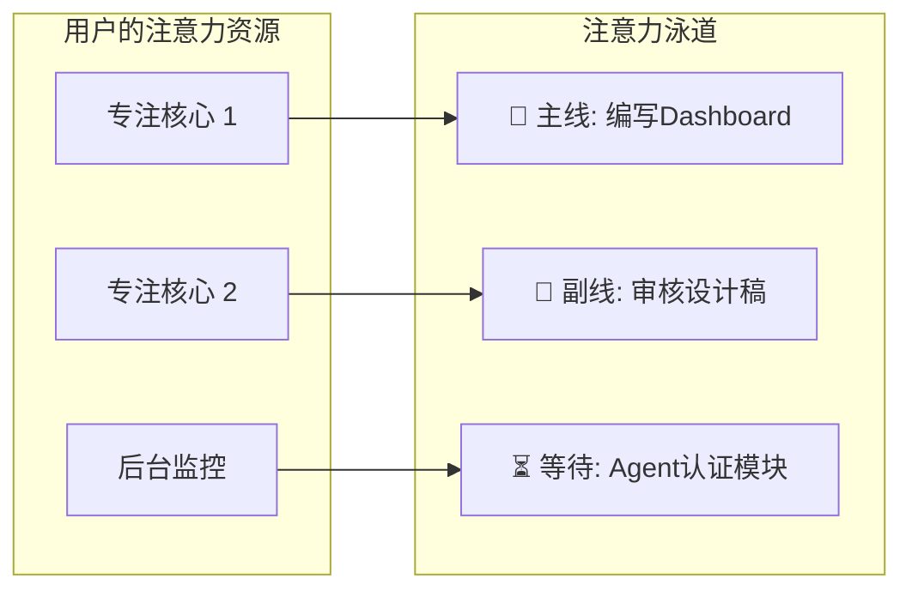
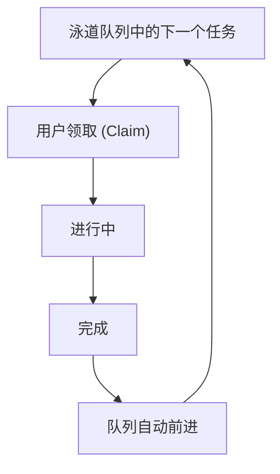
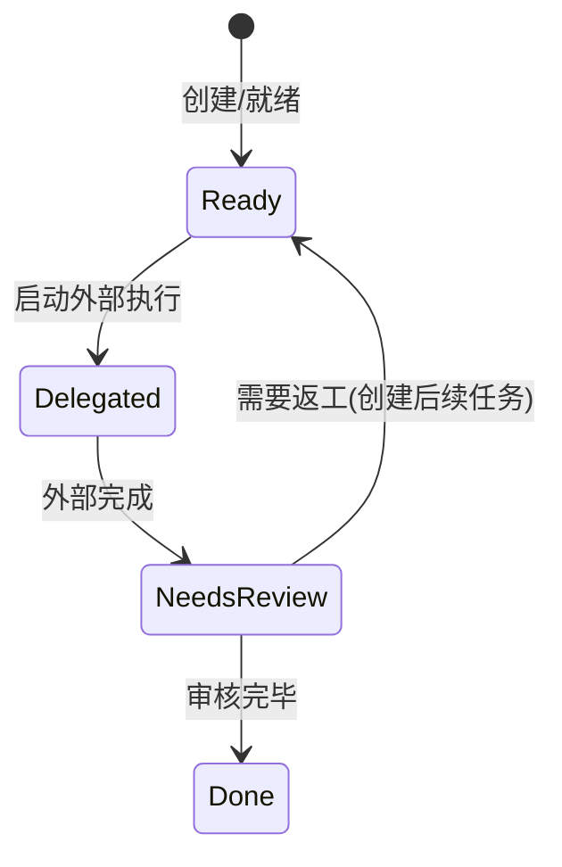

# DayRunway: 今日任务核心界面完全重构方案

## 一、问题诊断：当前模型为何失效

当前 `TodayView` 是一个**单线程顺序队列**：一个 Active 任务 + 一个按推荐排序的 Ready 列表。这与现实中人的工作模式严重脱节：

- **缺乏并行能力**：人在等待 CI 跑完的同时可以写文档、在等 agent 出结果时可以审设计稿。当前模型只能同时做一件事
- **缺乏外部任务概念**：很多任务是"启动后等待外部返回"，例如让 agent 执行 plan、提交 PR 等审核、等编译完成。这类任务不占用认知资源但需要追踪和及时响应
- **呈现不可信**：用列表排任务给人一种"线性流水线"的错觉，而实际工作是**多条并行轨道交错推进**
- **缺乏领取-完成的节奏感**：没有明确的"claim"动作，任务完成后的推进也是隐式的

---

## 二、核心概念：注意力泳道 (Attention Lane)

### 2.1 心智模型

将用户的注意力类比为 CPU 核心：



- **专注泳道 (Focus Lane)**: 需要用户主动投入认知资源的工作。一般人同时维持 1-2 条，极限 3 条
- **等待泳道 (Watch Lane)**: 已委派给外部执行的任务。不占认知资源，但需要在外部完成时及时响应。可以有多条
- **待分配池 (Backlog)**: 所有就绪但尚未安排到任何泳道的任务

### 2.2 每条泳道内的核心循环



"领取 → 执行 → 完成 → 领取下一个" 是每条泳道内的原子循环。**领取是一个明确的动作**，让用户从"我接下来要做什么"的决策中解放出来 -- 系统已经排好了顺序，用户只需确认。

### 2.3 外部任务生命周期



- **Delegated (已委派)**: 任务正在外部执行，显示运行时间和预估进度
- **NeedsReview (待审核)**: 外部完成，等待用户查看结果并决定下一步。此状态会触发提醒

### 2.4 泳道内容的确定逻辑

泳道内容遵循 **"继承 + 增量 + 手动调整"** 三层模型：

**第一层：每日继承（系统驱动）**

每天首次打开时，系统基于**前一天的泳道结构**初始化：

- 沿用昨天的泳道数量和名称（用户已经建立了自己的并行节奏，不应每天重建）
- 昨天泳道中**未完成的任务**保留在原泳道中，保持顺序
- 仍在运行的外部任务保留在其 Watch 泳道中
- 昨天已完成的任务清除，泳道内队列自动紧凑
- 如果是全新用户或昨天没有泳道记录，默认创建 1 条主泳道，将所有 Ready 任务按推荐引擎排序放入

**第二层：动态增量（事件驱动）**

工作过程中新变为 Ready 的任务（例如完成了某个依赖后解锁的后续任务）：

- **自动追加到当前正在活跃的泳道末尾** -- 保持工作流连贯，用户在同一条泳道里完成上游任务后，解锁的下游任务自然出现在后面
- 如果没有活跃泳道（所有泳道都暂停），则进入待分配池
- 启动外部任务时，系统自动创建/复用一条 Watch 泳道

**第三层：用户手动调整（用户驱动）**

用户随时可以重新分配任务：

- 拖拽任务在泳道间移动（"这个任务我想并行做，拖到副线去"）
- 从待分配池拖入泳道（"这个新 Ready 的任务我现在就要做"）
- 从泳道拖出到待分配池（"这个今天先不做了"）
- 泳道内拖拽调整顺序（"这个更紧急，排到前面"）

**关键原则：泳道不等于项目，不等于支线。** 一条泳道可以混合来自不同项目的任务。泳道代表的是"我的一条注意力线程"，按照用户的实际工作节奏而非项目结构来组织。

### 2.5 泳道的动态管理

- **新增泳道**: 顶部 "+ 泳道" 按钮，或从 Command Palette 快捷创建
- **关闭泳道**: 点击泳道头部的 "x"。泳道内未完成的任务**自动回到待分配池**，由系统推荐重新分配到剩余泳道
- **合并/拆分**: 关闭泳道时可选择将任务合并到指定泳道
- **重命名**: 双击泳道名称 inline 编辑

### 2.5 基于认知科学的设计约束

| 原则 | 实现 |
|------|------|
| 工作记忆容量 7 加减 2 | 每条泳道最多显示 5-7 个任务块，超出部分折叠为 "+N 项" |
| 注意力残留 (Attention Residue) | 泳道间切换时，短暂显示"正在切换到 [泳道名]" 的过渡提示 |
| 流态保护 (Flow State) | 外部任务完成通知为**非打断式** -- badge 标记而非弹窗；用户在专注泳道工作时不会被强制中断 |
| 决策疲劳 | "领取"动作是低认知成本的确认而非选择；系统已排好顺序，用户只需点一下 |
| 蔡格尼克效应 | 所有未完成任务可见于泳道或待分配池，减少"忘了什么"的焦虑 |
| 专注度健康 | 顶部显示当前并行度指示：1 泳道 "专注模式"、2 泳道 "并行模式"、3+ 泳道 "高负荷" 提示 |

---

## 三、DayRunway 界面设计

### 3.1 整体布局

用**自定义 React 组件**实现（不使用 React Flow），确保布局严格可控：

```
╭─────────────────────────────────────────────────────────────────╮
│ RunwayHeader                                                     │
│ 6月1日 周一  ·  ⬤ 并行模式 (2泳道)  ·  剩余3h20m / 可用6h       │
│ ██████████░░░░░                               [+ 泳道]  [⚙]    │
├─────────────────────────────────────────────────────────────────┤
│                                                                  │
│ 🎯 主线                                    2/5  ▾  ×           │
│ ┌─────────────┐  ┌───────────┐  ┌───────────┐  ┌─→ +2项       │
│ │ ★ 编写       │→│ CI 配置    │→│ 首页重构   │→│              │
│ │  Dashboard   │ │           │ │            │ │              │
│ │  HC·前端 45m │ │ HC·部署   │ │ 博客·前端  │ │              │
│ │  ████░ 进行中 │ │ 30m      │ │ 1h         │ │              │
│ │ [✓完成][⏸暂停]│ │           │ │            │ │              │
│ └─────────────┘  └───────────┘  └───────────┘  └──────────── │
│                                                                  │
│ 🎯 副线                                    0/2  ▾  ×           │
│ ┌───────────┐  ┌───────────┐                                    │
│ │ 审核设计稿  │→│ 回复邮件   │                                    │
│ │ 设计·UI    │ │           │                                    │
│ │ 20m       │ │ 15m       │                                    │
│ │ [▶ 领取]   │ │           │                                    │
│ └───────────┘  └───────────┘                                    │
│                                                                  │
│ ⏳ 等待 Agent                               0/1  ▾  ×           │
│ ╔═══════════════════════════════╗  ┌───────────┐                │
│ ║ ⟐ Agent: 实现用户认证          ║→│ 审核结果   │                │
│ ║   HC·后端                     ║ │ 15m       │                │
│ ║   ████████░░░ 运行 32min      ║ │           │                │
│ ║   预计 14:30 完成              ║ │           │                │
│ ╚═══════════════════════════════╝  └───────────┘                │
│                                                                  │
│ ┄┄ 待分配 (3项就绪) ┄┄┄┄┄┄┄┄┄┄┄┄┄┄┄┄┄┄┄┄┄┄┄┄┄┄┄┄┄┄┄┄ [展开] │
│  [图表组件 40m] [API文档 30m] [测试用例 25m]                      │
│                                                                  │
├─────────────────────────────────────────────────────────────────┤
│ CompletedBar                                                     │
│ ✓ 已完成 3项 (1h15m)  │  剩余 7项 (3h20m)  │  预计 17:52 收工   │
╰─────────────────────────────────────────────────────────────────╯
```

### 3.2 关键视觉元素

**任务块 (TaskBlock):**
- 专注泳道中的当前活跃任务: 蓝色左边框 + 微光背景 + 内置 [完成] [暂停] 按钮
- 就绪任务（队列第一个）: 显示 [领取] 按钮
- 后续就绪任务: 灰色卡片，悬停时显示快捷操作
- 宽度**松散地**与预估时间成比例（30min 基准宽度，按比例缩放，设上下限）

**外部任务块 (ExternalTaskBlock):**
- 双线边框 + 紫色/蓝色色调，区别于普通任务
- 内置进度条（基于已运行时间 / 预估时间）
- **完成时**闪烁橙色边框 + 显示 "已完成，等待审核" badge
- 点击可展开备注区域（记录外部执行的结果/链接）

**待分配池 (BacklogPool):**
- 默认折叠为一行紧凑标签（compact chips）
- 展开后显示完整任务卡片列表
- 支持拖拽到泳道中
- 系统按推荐引擎排序，最前面的是建议优先安排的

**泳道头 (LaneHeader):**
- 图标（🎯/⏳）+ 名称（可编辑）+ 进度（完成数/总数）+ 折叠/关闭按钮
- 专注泳道和等待泳道有不同的视觉主题

### 3.3 核心交互

**领取 (Claim):**
- 点击泳道中第一个就绪任务的 [领取] 按钮
- 该任务变为 Active，开始计时
- 视觉: 任务块变为活跃样式，出现 [完成] [暂停] 按钮

**完成:**
- 点击活跃任务的 [完成] 按钮
- Toast 反馈 + Undo
- 该任务滑出泳道，下一个任务自动前移
- 如果下一个任务存在，其 [领取] 按钮自动高亮脉冲提示

**启动外部执行:**
- 在任务的更多操作菜单中选择 "启动外部执行"
- 弹出轻量对话框：预估时间 + 备注（可选）
- 任务进入 Delegated 状态，泳道自动切换为 Watch 类型（如果不是的话）

**外部完成通知:**
- 手动标记：用户点击外部任务的 "标记已完成" 按钮
- 任务块变为橙色 "待审核" 状态
- 非打断式提醒: 泳道头出现 badge，底部栏出现提示条

**拖拽:**
- 任务可在泳道间拖拽移动
- 任务可在泳道内拖拽调整顺序
- 从待分配池拖拽到泳道
- 从泳道拖出到待分配池

**关闭泳道:**
- 点击泳道头部 x
- 泳道内剩余任务回到待分配池
- 如有活跃任务，先确认是否暂停

**新增泳道:**
- 点击顶部 [+ 泳道]
- 弹出小面板: 输入名称 + 选择类型（专注/等待）
- 或直接从待分配池/Command Palette 操作 "移入新泳道"

### 3.4 时间与进度

**时间预算条 (TimeBudgetBar):**
- 顶部进度条：已用时间 / 可用时间（到 day_end_time）
- 颜色: 绿色（充裕）→ 黄色（紧凑）→ 红色（超时）
- 显示: "剩余 Xh Ym 工作量 / 可用 Xh Ym"

**每条泳道的预估时间线:**
- 每个任务块上方或下方可选显示累计时间标记
- 最后一个任务后面显示该泳道的预估完成时间

**今日统计:**
- 底部栏: 已完成数量和时间 | 剩余数量和时间 | 预计收工时间
- 点击可展开查看已完成任务列表

### 3.5 长远视野

用户说"需要能看得到更长远的事情"，在 DayRunway 中体现为:

- 每条泳道的任务队列本身就是"接下来要做的事"的可视化
- 待分配池中的任务是"今天可能做不完但已 Ready 的事"
- 底部统计中"预计 XX:XX 收工"给出了一天如何收尾的预期
- 如果剩余工作量超过可用时间，用红色提示并建议移除低优先级任务

### 3.6 过去的未完成任务

- DayRunway 初始化时，自动检查前一天泳道中未完成的任务
- 在顶部显示提醒条: "昨日有 N 项未完成" + [查看] 按钮
- 点击展开列表，用户可选择: 加入今天的泳道 / 移到待分配 / 取消任务

---

## 四、数据模型变更

### 4.1 新增 SQLite 表

在 [`db.rs`](src-tauri/src/db.rs) 的 `migrate()` 中新增:

```sql
-- 每日泳道配置
CREATE TABLE IF NOT EXISTS day_lanes (
    id TEXT PRIMARY KEY NOT NULL,
    date TEXT NOT NULL,
    name TEXT NOT NULL,
    lane_type TEXT NOT NULL DEFAULT 'focus',  -- 'focus' | 'watch'
    sort_order INTEGER NOT NULL DEFAULT 0,
    created_at TEXT NOT NULL
);

-- 任务到泳道的分配
CREATE TABLE IF NOT EXISTS day_lane_tasks (
    id TEXT PRIMARY KEY NOT NULL,
    lane_id TEXT NOT NULL REFERENCES day_lanes(id) ON DELETE CASCADE,
    task_id TEXT NOT NULL,
    sort_order INTEGER NOT NULL DEFAULT 0,
    UNIQUE(lane_id, task_id)
);
```

### 4.2 Task 表扩展

```sql
ALTER TABLE tasks ADD COLUMN task_type TEXT NOT NULL DEFAULT 'normal';
  -- 'normal' | 'external'
ALTER TABLE tasks ADD COLUMN external_status TEXT;
  -- NULL | 'delegated' | 'needs_review'
ALTER TABLE tasks ADD COLUMN external_started_at TEXT;
ALTER TABLE tasks ADD COLUMN external_completed_at TEXT;
ALTER TABLE tasks ADD COLUMN external_note TEXT;
```

### 4.3 Active 任务约束变更

当前: 全局只允许 1 个 Active 任务（`activate_task` 会将所有其他 Active 设为 Ready）

变更为: **每个泳道最多 1 个 Active 任务**。激活某泳道中的任务时，只将该泳道内的其他 Active 任务暂停。不同泳道的 Active 任务互不影响。

### 4.4 Rust 模型新增

在 [`models.rs`](src-tauri/src/models.rs) 中:

- `DayLane { id, date, name, lane_type, sort_order, created_at }`
- `DayLaneTask { id, lane_id, task_id, sort_order }`
- `DayLaneSnapshot { lane: DayLane, tasks: Vec<TodayTaskContext>, active_task_id: Option<String> }` -- 用于前端渲染一条泳道
- `DayRunwaySnapshot { lanes: Vec<DayLaneSnapshot>, backlog: Vec<TodayTaskContext>, completed_today: Vec<TodayTaskContext>, time_budget: TimeBudget, carry_over_count: i32 }`  -- 替代当前的 `TodaySnapshot`

### 4.5 TypeScript 类型新增

在 [`types/index.ts`](src/types/index.ts) 中:

- `TaskType = "normal" | "external"`
- `ExternalStatus = "delegated" | "needs_review" | null`
- `DayLane`, `DayLaneTask`, `DayLaneSnapshot`, `DayRunwaySnapshot`
- `Task` 扩展: `taskType`, `externalStatus`, `externalStartedAt`, `externalCompletedAt`, `externalNote`

---

## 五、后端 API 变更

在 [`commands.rs`](src-tauri/src/commands.rs) 中新增:

**泳道管理:**
- `get_day_runway_snapshot(date)` -- 替代 `get_today_snapshot`，返回 `DayRunwaySnapshot`
- `create_day_lane(date, name, lane_type)` -- 创建泳道
- `close_day_lane(lane_id)` -- 关闭泳道，任务回到 backlog
- `rename_day_lane(lane_id, name)`
- `reorder_day_lanes(lane_ids: Vec<String>)`

**泳道任务管理:**
- `assign_task_to_lane(task_id, lane_id, position)` -- 将任务加入泳道
- `remove_task_from_lane(task_id, lane_id)` -- 将任务从泳道移回 backlog
- `reorder_lane_tasks(lane_id, task_ids: Vec<String>)` -- 调整泳道内顺序
- `move_task_between_lanes(task_id, from_lane_id, to_lane_id, position)`

**外部任务:**
- `start_external_task(task_id, estimated_minutes, note)` -- 将任务标记为外部执行中
- `complete_external_task(task_id)` -- 标记外部已完成，进入 needs_review
- `review_external_task(task_id, action: "done" | "rework")` -- 审核外部结果

**激活/领取:**
- `claim_task(task_id, lane_id)` -- 在指定泳道中领取任务（替代当前的 `activate_task`，只暂停同泳道内其他 active）

**自动分配:**
- `auto_populate_runway(date)` -- 基于推荐引擎自动填充今日泳道（早晨首次打开时调用）

在 [`today.rs`](src-tauri/src/today.rs) 中重写 `build_today_snapshot` 为 `build_day_runway_snapshot`:
- 聚合所有项目的 Active + Ready 任务
- 按泳道分组
- 未分配到泳道的 Ready 任务进入 backlog
- 计算 per-lane 时间预算和全局时间预算

---

## 六、前端组件架构

完全替换 `src/components/today/` 目录，新建 `src/components/runway/`:

```
src/components/runway/
├── DayRunway.tsx          -- 主容器，替代 TodayView
├── DayRunway.css
├── RunwayHeader.tsx       -- 日期 + 并行度指示 + 时间预算条
├── LanesContainer.tsx     -- 泳道列表容器（支持泳道间拖拽排序）
├── LaneRow.tsx            -- 单条泳道
├── LaneHeader.tsx         -- 泳道头部（名称/类型/进度/操作）
├── LaneTrack.tsx          -- 泳道内的任务轨道（水平滚动）
├── TaskBlock.tsx           -- 普通任务块
├── ExternalTaskBlock.tsx   -- 外部任务块（含进度条和状态指示）
├── BacklogPool.tsx         -- 待分配池
├── BacklogChip.tsx         -- 待分配任务紧凑标签
├── CompletedBar.tsx        -- 底部完成统计条
├── AddLaneDialog.tsx       -- 新增泳道轻量对话框
├── CarryOverBanner.tsx     -- 昨日未完成提醒条
└── FocusHealthIndicator.tsx -- 专注度健康指示器
```

### 关键设计决策

- **不使用 React Flow**: DayRunway 是**纯自定义 React 组件** + CSS Grid/Flexbox 布局。React Flow 的自由画布属性在此场景下是负资产 -- 我们需要的是严格可控的泳道排列，不是自由拖拽画布
- **拖拽库**: 使用 `@dnd-kit/core` 实现任务块的跨泳道拖拽和泳道内重排序
- **水平滚动**: 每条泳道内的任务轨道在任务多时支持水平滚动，避免撑开布局

### Store 变更

在 [`appStore.ts`](src/store/appStore.ts) 中:

- 将 `todaySnapshot: TodaySnapshot | null` 替换为 `runwaySnapshot: DayRunwaySnapshot | null`
- 新增泳道管理方法: `createLane`, `closeLane`, `renameLane`, `reorderLanes`
- 新增任务分配方法: `assignToLane`, `removeFromLane`, `reorderLaneTasks`, `moveBetweenLanes`
- 新增外部任务方法: `startExternal`, `completeExternal`, `reviewExternal`
- 修改 `completeTask`: 完成后在同泳道自动推进
- 新增 `claimTask(taskId, laneId)`: 替代 `activateTask` 的泳道感知版本
- `refreshToday` 改为 `refreshRunway`

---

## 七、三层交互面适配

### Layer 1 菜单栏 (Tray)

在 [`tray.rs`](src-tauri/src/tray.rs) 中:

- 显示所有活跃泳道及其当前任务（不再是单个活跃任务）
- 格式: "🎯 主线: 编写 Dashboard" / "⏳ Agent: 用户认证 (运行中)"
- 每个活跃泳道的任务旁有 [完成] 操作
- 外部任务完成时在 Tray 图标上显示 badge

### Layer 2 悬浮窗

在 [`FloatingWidget.tsx`](src/components/floating/FloatingWidget.tsx) 中:

- 折叠态: 显示当前活跃泳道数和最近活跃任务
- 展开态: 紧凑版泳道列表，每条泳道显示当前任务 + [完成] 按钮
- 外部任务完成时在对应泳道行上显示提醒 badge

### Layer 3 主窗口

在 [`AppShell.tsx`](src/components/layout/AppShell.tsx) 中:

- `currentView === "today"` 时渲染 `DayRunway` 替代 `TodayView`
- Sidebar "今日" 按钮进入 DayRunway

---

## 八、实施阶段

### Phase 1: 数据层 + 后端 API

- Rust 模型新增 (`DayLane`, `DayLaneTask`, 扩展 `Task`)
- SQLite migration (新表 + ALTER)
- 泳道 CRUD commands
- `get_day_runway_snapshot` 实现
- `claim_task` (泳道感知的 activate)
- 自动填充逻辑 (`auto_populate_runway`)

### Phase 2: DayRunway 核心组件

- `DayRunway` 主容器 + `RunwayHeader` + `CompletedBar`
- `LaneRow` + `LaneHeader` + `LaneTrack`
- `TaskBlock` (Active/Ready/Queued 三态)
- 领取/完成的核心循环
- AppShell 集成 (替换 TodayView)
- Zustand store 改造

### Phase 3: 泳道管理 + 拖拽

- 泳道新增/关闭/重命名交互
- `BacklogPool` + `BacklogChip`
- 拖拽排序（泳道内 + 跨泳道 + backlog 到泳道）
- 泳道关闭时任务重分配逻辑

### Phase 4: 外部任务

- `ExternalTaskBlock` 组件（进度条 + 状态流转）
- "启动外部执行" 交互
- "标记外部完成" + "待审核" 状态
- 外部完成通知（非打断式 badge + 提示条）
- Watch Lane 自动创建/管理

### Phase 5: 三层交互面适配

- Tray 适配多泳道
- 悬浮窗紧凑泳道列表
- Command Palette 新增泳道相关命令
- `CarryOverBanner` (昨日未完成提醒)
- `FocusHealthIndicator` (并行度指示)

### Phase 6: 打磨

- 拖拽动画 + 任务完成滑出动画
- 泳道折叠/展开过渡
- 键盘导航 (Tab 跨泳道, 方向键泳道内导航)
- 外部任务计时器精度优化
- 响应式布局（窗口窄时泳道堆叠）
