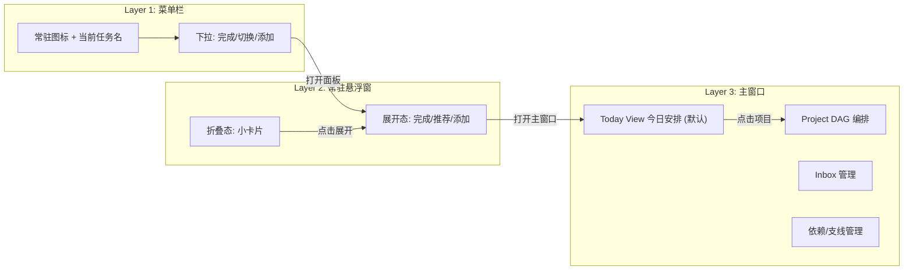
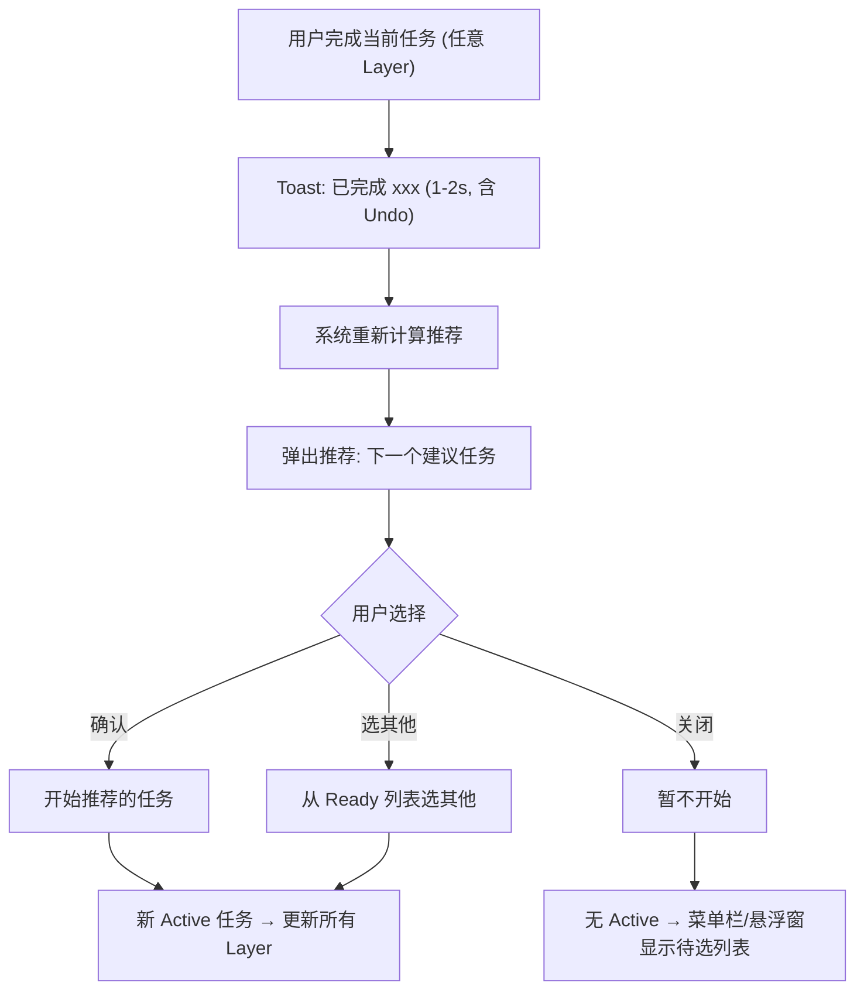
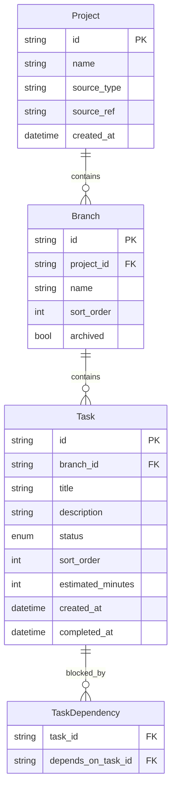
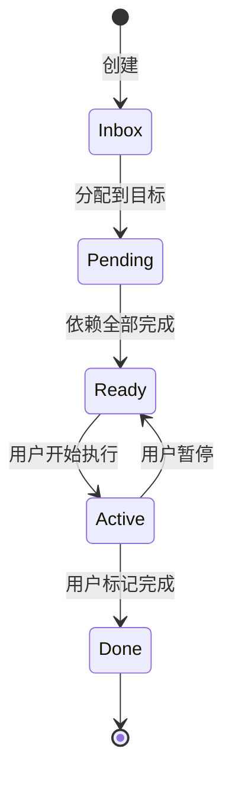
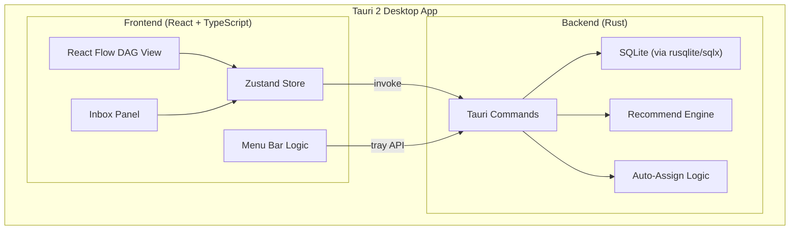

# Human Composer 产品设计与实施方案

## 设计哲学

1. **Minimum effort** -- 用户输入以语音/自然语言为主；能自动化就自动化，能直观呈现就直观呈现
2. **e/acc** -- 有效加速，帮助用户实现效率最大化
3. **前额叶保护** -- 用户的前额叶资源有限，软件的核心效用是解放前额叶、延长前额叶在线时间；一切设计决策都应减少用户的认知负荷
4. **细粒度、低阻力** -- 专注管理碎片化的具体任务，高触发频率要求记录和反馈流程极简

### 哲学推导出的交互原则

- **每个高频操作 <= 2 步完成**（minimum effort）
- **系统主动呈现可执行洞察，而非被动展示数据**（e/acc）
- **完成任务后零认知间隙：自动推荐下一个**（前额叶保护）
- **无确认弹窗，误操作靠 Undo 挽回**（细粒度、低阻力）：操作即生效 + 1-2 秒 toast 提示含 Undo 按钮

---

## 产品核心视角：以人为中心的日程管理

Human Composer 服务于**单一用户**跨多项目的时间管理。产品提供两种互补视角：

| 视角 | 入口 | 回答的问题 |
|------|------|-----------|
| **Today View（今日安排）** | 应用默认首页 | 从现在到今天结束，我该按什么顺序做什么？做完大约几点？ |
| **Project DAG（项目编排）** | Sidebar 点击项目 | 这个项目的并行支线、依赖关系如何编排？ |

Today View 是「现在该做什么」的终极答案；Project DAG 是深度编排工具，仅在需要规划项目结构时使用。

---

## 分层交互模型

用户的日常执行不依赖主窗口。三层交互面按认知成本递增排列：



- **Layer 1 菜单栏**：零成本 glance，一键完成当前任务（跨项目 today snapshot）
- **Layer 2 悬浮窗**：日常执行的主界面，展示今日队列前几项，支持「完成→推荐→开始」循环
- **Layer 3 主窗口**：默认 Today View（跨项目日程时间轴）；点击 Sidebar 项目进入 Project DAG 深度编排

### 核心执行循环



---

## UI 组件层级

### Layer 3: 主窗口

```
AppShell
+-- TitleBar (Tauri 自定义标题栏, 可拖拽)
+-- Sidebar (左侧, 可折叠)
|   +-- TodayButton ("今日", 默认选中)
|   +-- ProjectList
|   |   +-- ProjectItem (点击进入项目 DAG)
|   +-- AddProjectButton
+-- MainContent
|   +-- [TodayView] (默认视图)
|   |   +-- TodayHeader (日期 + TimeBudgetBar)
|   |   +-- ActiveTaskCard (当前任务大卡片)
|   |   +-- ScheduleList (可拖拽排序的任务序列)
|   |   +-- DaySummary (已完成/剩余统计)
|   +-- [ProjectDAGView] (点击项目时切换)
|   +-- ProjectHeader (项目名 + 统计: N active / N ready)
|   +-- DAGCanvas (React Flow 画布, 占满剩余空间)
|   |   +-- BranchLane (每条支线一行, 含标签)
|   |   +-- TaskNode (自定义节点, 按状态着色)
|   |   +-- SequentialEdge (同支线, 实线)
|   |   +-- BlockingEdge (跨支线, 虚线)
|   |   +-- AddTaskHandle (支线末尾的 + 按钮)
|   +-- InboxPanel (底部抽屉, 可展开/收起)
|       +-- QuickAddInput (输入框, Enter 即创建)
|       +-- InboxTaskList
|           +-- InboxTaskItem (可拖拽到 DAG)
+-- DetailPanel (右侧滑出, 点击任务节点时出现)
|   +-- TaskTitle (可编辑)
|   +-- TaskDescription (可编辑)
|   +-- StatusBadge + ActionButtons
|   +-- DependencyList (此任务的上下游)
|   +-- ContextInfo (所属项目/支线)
+-- ToastContainer (右下角, 操作反馈 + Undo)
```

### Layer 2: 常驻悬浮窗

```
FloatingWidget (macOS 窗口, always-on-top, 可拖拽定位)
+-- CollapsedState (默认, 小卡片 ~200x48px)
|   +-- ActiveTaskBadge (任务名截断)
|   +-- QuickCompleteButton (勾选图标)
+-- ExpandedState (点击展开, ~320x400px)
    +-- CurrentTaskSection
    |   +-- TaskName + ProjectBranch 标签
    |   +-- CompleteButton (醒目)
    +-- RecommendSection (完成后自动出现)
    |   +-- RecommendedTask (高亮, 含 Start 按钮)
    |   +-- ReadyTaskList (其他可执行任务, 可点击切换)
    +-- QuickAddInput (底部输入框, 添加到 Inbox)
    +-- FooterActions
        +-- OpenMainWindow 按钮
```

### Layer 1: 菜单栏

```
TrayIcon (macOS 菜单栏)
+-- 图标 + 当前任务名 (截断, 可配置是否显示文字)
+-- TrayMenu (点击展开)
    +-- CurrentTask: "正在: xxx" + [完成] 按钮
    +-- Separator
    +-- ReadyTasks: "推荐下一个:"
    |   +-- TaskItem (点击 → 设为 Active)
    |   +-- TaskItem ...
    +-- Separator
    +-- "快速添加任务..." (点击弹出输入)
    +-- "打开 Human Composer"
    +-- Separator
    +-- "退出"
```

---

## 核心概念模型



### 层级关系

- **Project**：顶层容器（例如"Human Composer 开发"、"博客重构"）。`source_type` 字段预留外部同步接口（`manual` / `linear` / `github` 等）
- **Outcome（目标，代码 `Outcome`，DB `branches`）**：项目内可并行推进的、可衡量的交付成果（类 OKR 的 KR，例如「登录页可上线」）。可归档。UI 称「目标」，≠ 泳道
- **Action（行动，代码 `Action`，DB `tasks`）**：目标内的具体可执行步骤，细粒度（几分钟到半小时级别）
- **ActionDependency（行动依赖，DB `task_dependencies`）**：行动间的阻塞关系，支持跨目标依赖

### 行动状态机



- **Inbox**：刚创建，尚未分配到任何目标
- **Pending**：已在目标中，但有未完成的前置依赖
- **Ready**：所有依赖已满足，可以开始
- **Active**：当前正在执行
- **Done**：已完成

### App Settings

- `day_end_time`：用户的一天结束时间（默认 `"22:00"`），用于 Today View 计算可用时间
- `active_project_id`：当前活跃项目

---

## 今日安排视图（Today View）

### 定位

- 应用**默认首页**，聚合所有项目的 Active + Ready 任务
- 叠加**时间维度**：每个任务有 `estimated_minutes`（默认 30），按累加映射到时间轴
- 用户打开应用即可回答「现在该做什么、今天还能做多少」

### 布局

```
今日安排                           剩余 3h20min / 可用 6h40min
━━━━━━━━━━━━━━━━━━━━━━━━━━━━━━━━━━━━━━━━━━━━━━━━━━━━━━━━━━
 13:30  ★ Dashboard 页面               HC开发 · 前端
 NOW      预估 45min                   [完成] [暂停]
────────────────────────────────────────────────────────────
 14:15    CI 配置                      HC开发 · 部署
          预估 30min
━━━━━━━━━━━━━━━━━━━━━━━━━━━━━━━━━━━━━━━━━━━━━━━━━━━━━━━━━━
 今日已完成 5 项 · 剩余 4 项 · 预计 16:25 完成
```

### 交互规则

- **完成当前任务** → 队列自动上移，时间段重算，下一个成为 Active（无弹窗）
- **拖拽调整顺序** → 覆盖推荐排序，时间段随之重算
- **点击项目标签** → 切换到该项目的 DAG 视图
- **跳过任务** → 移到队列末尾或从今日安排移除

### Today Snapshot API

`get_today_snapshot` 返回：
- 跨项目 Active 任务（全局最多 1 个）
- 跨项目 Ready 任务（推荐引擎排序）
- 今日已完成任务列表
- 时间预算（剩余工作量 / 可用时间 / 预计完成时间）

---

## 核心视觉：泳道 DAG

### 布局规则

```
Project: Human Composer 开发
━━━━━━━━━━━━━━━━━━━━━━━━━━━━━━━━━━━━━━━━━━━━━━━
 前端  ║ [登录页面] ──→ [Dashboard] ──→ [图表组件]
       ║     ✓            ★ Active        ○ Ready
━━━━━━━║━━━━━━━━━━━━━━━━━━━━━━━━━━━━━━━━━━━━━━━━━
 后端  ║ [用户API] ──→ [认证中间件] ──┐
       ║     ✓            ✓          │
━━━━━━━║━━━━━━━━━━━━━━━━━━━━━━━━━━━━━│━━━━━━━━━━━
 部署  ║          [CI 配置] ─────────→│ [首次部署]
       ║             ○ Ready          └──→ ○ Ready
━━━━━━━━━━━━━━━━━━━━━━━━━━━━━━━━━━━━━━━━━━━━━━━━━
```

- 横轴：执行顺序（左 → 右）
- 纵轴：并行支线（上下排列）
- 节点：任务卡片，用颜色/图标区分状态
- 边：同支线内为顺序关系，跨支线为阻塞依赖（虚线箭头）
- **高亮**：Ready 状态的任务用醒目样式标出，Active 任务最突出

### React Flow 实现要点

- 自定义节点类型：`TaskNode`（不同状态有不同视觉样式）
- 自定义边类型：`SequentialEdge`（同支线）、`BlockingEdge`（跨支线，虚线）
- 自动布局算法：使用 dagre 或 elkjs 进行层级布局，按支线分组
- 支持用户拖拽调整、缩放、平移

---

## 任务收集与分配

### 任务输入入口（全部仅需任务名，Enter 即创建）

- 主窗口 Inbox 底部抽屉的 QuickAddInput
- 悬浮窗展开态底部的 QuickAddInput
- 菜单栏下拉的 "快速添加任务"
- 泳道内支线末尾的 + 按钮（直接创建在该支线，跳过 Inbox）

### Inbox 到支线的分配

- **手动**：从 Inbox 拖拽到泳道图的某条支线
- **自动**（day 1）：创建时基于任务名关键词自动匹配支线，以推荐形式呈现，用户一键确认或修改
- 支线末尾 + 按钮创建的任务直接跳过 Inbox，状态为 Pending 或 Ready（取决于依赖）

---

## "现在该做什么" 推荐逻辑

### 算法

1. **筛选**：所有 status = Ready 的任务（Today View 跨所有项目聚合）
2. **排序**（加权组合）：
   - **关键路径优先**：阻塞下游任务最多的排前
   - **支线均衡**：长时间未推进的支线权重提升（鼓励并行）
   - **用户置顶**：手动标记的优先任务权重最高
3. **呈现**：排序后的 Ready 列表，#1 为"推荐"，在 Today View / DAG / 悬浮窗 / 菜单栏同步高亮

### 日程排布（Today View）

推荐排序后的 Ready 队列，按 `estimated_minutes` 累加映射到从当前时间开始的时间段：
- 用户可拖拽调整顺序（覆盖推荐排序）
- 完成任务后，已完成项折叠，剩余任务时间段自动前移
- 时间预算 = 剩余任务总时长 vs 当前时间到 `day_end_time` 的可用时间

### 完成→推荐循环（核心交互）

用户在任意 Layer 完成任务后：
1. Toast 反馈 (1-2s) + Undo
2. 系统重算推荐与日程排布
3. **Today View**：队列自动上移，下一个任务成为 Active（无弹窗）
4. **Project DAG**：右下角滑入式推荐卡片（非模态），5-8 秒后自动消失
5. 所有 Layer 同步更新状态

---

## 技术架构



### 前端

- **状态管理**：Zustand（轻量，适合 Tauri 场景）
- **图形渲染**：`@xyflow/react` + dagre/elkjs 自动布局
- **窗口管理**：Tauri 多窗口 -- 主窗口 + 悬浮窗（WebviewWindow, always_on_top, decorations: false）
- **组件结构**：
  - `TaskNode` -- 自定义 React Flow 节点（状态着色 + 内联操作按钮）
  - `InboxPanel` -- 任务收集面板（底部抽屉）
  - `DetailPanel` -- 任务详情（右侧滑出）
  - `FloatingWidget` -- 悬浮窗组件（独立 Tauri 窗口渲染）
  - `ProjectSelector` -- 项目切换
  - `ToastManager` -- 操作反馈 + Undo

### 后端

- **Tauri Commands**：CRUD + 推荐计算 + 自动分配 + 状态同步
- **SQLite**：通过 `rusqlite` 或 `sqlx`
- **推荐引擎**：Rust 实现关键路径分析 + 支线均衡排序
- **自动分配**：早期基于关键词规则匹配，后续可接 LLM
- **Tray**：Tauri 2 tray API，菜单项根据任务状态动态更新

### 数据流与跨窗口同步

1. 用户操作 → 前端 invoke → Rust 写入 SQLite → 返回 → Zustand 更新 → 当前窗口 UI 刷新
2. 任务状态变更 → Rust 重算推荐 → Tauri event emit → 所有窗口（主窗口 + 悬浮窗）监听并同步更新
3. 菜单栏通过 Rust 端直接读取推荐结果，动态重建 tray menu items

---

## 分阶段实施

### Phase 1: 数据基础 + 基础渲染

目标：从 SQLite 读取真实数据，在泳道 DAG 上渲染

- Rust 数据模型定义（Project, Branch, Task, TaskDependency structs + enums）
- SQLite 建表迁移（`rusqlite` + 手动 migration 或 `sqlx` + 编译期校验）
- 基础 CRUD Tauri Commands（create/read/update/delete project, branch, task）
- 前端 Zustand store + Tauri invoke 通信层
- React Flow 自定义 `TaskNode` 节点 + dagre 自动泳道布局
- 基础 UI 骨架：深色主题、左侧 Sidebar（项目列表）、主画布区

### Phase 2: 核心交互 + 多窗口

目标：完整的任务创建→分配→执行→完成闭环 + 三层交互面

- Inbox 底部抽屉 + QuickAddInput
- 任务分配：Inbox 拖拽到支线 + 支线末尾 + 按钮直接创建
- 任务状态流转（节点内联按钮：开始/完成/暂停）
- 依赖关系可视化编辑（在 DAG 上连线创建依赖）
- 任务 DetailPanel（右侧滑出）
- Toast + Undo 机制
- 常驻悬浮窗（Tauri 多窗口：折叠/展开态，完成+切换+添加）
- macOS 菜单栏指示器（tray icon + 动态下拉菜单）

### Phase 3: 推荐引擎 + 核心循环

目标：产品核心价值 -- "完成→推荐→开始" 自动循环

- 推荐算法实现（关键路径分析 + 支线均衡 + 用户置顶）
- Ready 任务在 DAG / 悬浮窗 / 菜单栏同步高亮
- 完成任务后自动推荐下一个（三层同步）
- 自动分配逻辑（基于关键词匹配推荐支线）
- 支线归档功能

### Phase 4: 提效增强

目标：进一步降低操作阻力

- 全局快捷键（完成当前任务、快速添加、切换任务）
- 命令面板（Cmd+K 风格，自然语言输入）
- 语音输入集成（macOS Speech API 或 Whisper）
- 外部源同步接口骨架（Rust trait 定义 + manual source 实现，预留 Linear / GitHub 等）

---

## 需同步到项目文档的变更

- [AGENTS.md](AGENTS.md)：新增设计哲学第 3 条（前额叶保护）和第 4 条（细粒度、低阻力）
- [devlog.md](devlog.md)：记录本次产品设计讨论的关键决策
