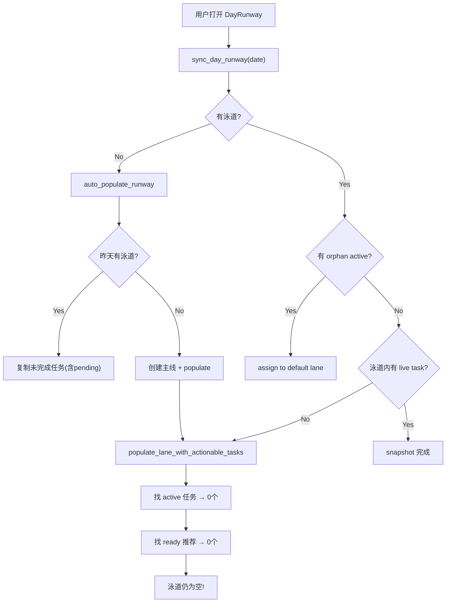

# DayRunway 执行核查 + 补漏计划

## 一、各 Phase 执行核查

### Phase 1-4: 基本完整

数据层、核心组件、泳道管理/拖拽、外部任务的主体功能均已实现。代码结构与 plan 规划一致：

- Rust: `DayLane`, `DayLaneTask`, `DayLaneSnapshot`, `DayRunwaySnapshot` 模型完整
- SQLite: `day_lanes`, `day_lane_tasks` 表 + Task 扩展字段完整
- 前端: `src/components/runway/` 下 13 个组件全部存在，DnD 拖拽、外部任务、BacklogPool 均实现
- Store: `runwaySnapshot` 替代了 `todaySnapshot`，泳道 CRUD + 领取/完成循环完整

### Phase 5: 基本完整，细节待验

- `FocusHealthIndicator` / `CarryOverBanner` 已实现
- Tray / 悬浮窗适配需实际运行验证

### Phase 6: 有明显缺口

- **键盘导航**: 仅有 LaneRow 的 rename Escape 和 AddLaneDialog 的 Escape，**没有** Tab 跨泳道、方向键泳道内导航
- 动画/过渡: CSS 有基本 transition，但缺少任务完成滑出、泳道折叠展开等流畅动画
- 响应式布局: 未见窗口窄时泳道堆叠的实现

---

## 二、关键 BUG：所有任务 pending 时泳道为空

### 根因分析



**核心问题在 `populate_lane_with_actionable_tasks`** ([db.rs:1093-1126](src-tauri/src/db.rs))：

1. 只把 `active` 任务放入泳道
2. 然后用 `build_today_snapshot` 生成推荐调度，只包含 `ready` 任务
3. **`pending` 任务被完全忽略** -- 如果所有任务都是 pending，泳道就是空的

结果：用户看到 "主线 0/0" + "拖拽任务到此处"，而待分配区显示 4 项"等待依赖"。泳道毫无用处。

### 更深层设计问题

不仅是 auto-populate 的问题。当前的整体设计把 pending 任务当作"还不该出现在泳道里的东西"，但这与用户的核心需求冲突：

> **用户需要看到完整的工作管线 (pipeline)，包括等待中的任务，才能理解"我为什么在做当前这件事"以及"做完后接下来会怎样"。**

---

## 三、补漏方案

### 改动 1: Pending 任务可进入泳道 (后端 + 前端)

**后端** -- `populate_lane_with_actionable_tasks` 改造:

- 除了 active + ready 推荐，还应把相关 pending 任务按依赖拓扑排序后追加到泳道末尾
- 逻辑：对于每个已放入泳道的 ready/active 任务 T，找到所有直接或间接依赖 T 的 pending 任务（即 T 的下游），按拓扑序追加
- 这样泳道内容呈现为：`active → ready → pending(被 ready 阻塞的) → pending(更远的依赖链)`

**前端** -- TaskBlock pending 态渲染:

- `LaneTrack.tsx`: 识别 pending 任务，渲染为带虚线边框 + 降低不透明度的 TaskBlock
- `TaskBlock.tsx`: 新增 `isPending` prop，显示"等待依赖"标签替代 claim 按钮，宽度同样基于预估时间
- 不可 claim，不可 complete，但可拖拽重排序和移出泳道

### 改动 2: 依赖信息加入 Runway Snapshot (数据层)

当前 `DayRunwaySnapshot` 和 `TodayTaskContext` **不包含任何依赖数据**，前端无从知道任务间关系。

**后端** -- 扩展 `DayRunwaySnapshot`:

```rust
pub struct DayRunwaySnapshot {
    // ... existing fields ...
    pub dependencies: Vec<TaskDependency>,  // 新增：runway 涉及任务的依赖关系
}
```

只传输 runway 中涉及的任务（泳道内 + backlog）之间的依赖边，不是全库依赖。

**TypeScript 同步**:

```typescript
export interface DayRunwaySnapshot {
  // ... existing fields ...
  dependencies: TaskDependency[];
}
```

### 改动 3: 泳道内依赖可视化 (前端)

在泳道的水平任务队列中，增加任务间关系的视觉指示：

**方案：依赖连接线 + 标签**

- 泳道内相邻任务间：如果存在依赖关系，用箭头连接线（`→` 指示器）标注
- 泳道内非相邻任务间的依赖：在 pending 任务的 TaskBlock 上显示 chip："被 [上游任务名] 阻塞"
- 跨泳道依赖：pending 任务 tooltip 显示完整依赖链

**实现**:

- `LaneTrack.tsx`: 在任务块之间插入 `DependencyConnector` 组件（一个简单的 SVG 箭头或 CSS 伪元素）
- `TaskBlock.tsx` (pending 态): 底部显示 "等待: [上游任务标题]" 文字标签
- 使用 snapshot 中的 `dependencies` 数据计算上下游关系

### 改动 4: 增强时间预估可视化 (前端)

当前 TaskBlock 宽度范围 120-220px 过窄，且时间信息藏在 meta 行里不够醒目。

- **宽度范围扩大**: 100-320px，让 15min vs 120min 的任务有明显视觉差异
- **时间标签醒目化**: 在 TaskBlock 右上角用 badge 样式显示 `45m`，pending 任务显示 `~45m`（预估）
- **泳道时间线**: 在泳道轨道下方增加一条简单的累计时间轴，标注每个任务预期的起止时间点（仅 ready/active 任务计时间，pending 任务显示为虚线段）
- **Pending 任务的总时间**: 在泳道头部除了 `completedCount/totalCount` 外，显示 pending 部分的预估总时间，如 "主线 2/5 (待解锁 ~1h30m)"

---

## 四、涉及文件清单

### 后端 (Rust)

| 文件 | 改动 |
|------|------|
| [`src-tauri/src/models.rs`](src-tauri/src/models.rs) | `DayRunwaySnapshot` 增加 `dependencies` 字段 |
| [`src-tauri/src/runway.rs`](src-tauri/src/runway.rs) | `build_day_runway_snapshot` 输出依赖边 |
| [`src-tauri/src/db.rs`](src-tauri/src/db.rs) | `populate_lane_with_actionable_tasks` 增加 pending 下游追加逻辑；新增辅助方法获取 downstream pending 任务 |

### 前端 (TypeScript/React)

| 文件 | 改动 |
|------|------|
| [`src/types/index.ts`](src/types/index.ts) | `DayRunwaySnapshot` 增加 `dependencies` |
| [`src/components/runway/LaneTrack.tsx`](src/components/runway/LaneTrack.tsx) | 渲染 pending TaskBlock；插入依赖连接指示器 |
| [`src/components/runway/TaskBlock.tsx`](src/components/runway/TaskBlock.tsx) | 新增 pending 态样式（虚线、降透明度、等待标签）；时间 badge 醒目化；宽度范围调整 |
| [`src/components/runway/LaneRow.tsx`](src/components/runway/LaneRow.tsx) | 泳道头部显示 pending 预估时间统计 |
| [`src/components/runway/DayRunway.css`](src/components/runway/DayRunway.css) | pending 态、依赖连接线、时间 badge 样式 |
| [`src/components/runway/BacklogPool.tsx`](src/components/runway/BacklogPool.tsx) | 已在泳道内的 pending 任务不再显示在 backlog (由后端 snapshot 逻辑自动处理) |

---

## 五、UI 交互优化方案

基于四项核心设计原则逐项审计 DayRunway 全链路后，提出以下优化。按影响分级排列。

### 设计原则速查

- **Minimum effort**: 能自动化就自动化，能直观呈现就直观呈现
- **e/acc**: 有效加速，效率最大化
- **前额叶保护**: 减少认知负荷，延长前额叶在线时间
- **细粒度、低阻力**: 高频操作极简

---

### 优化 A: NowStrip — 一句话回答「现在该做什么」(前额叶保护)

**问题**: DayRunway 页面打开后，用户需要从上到下扫描多个泳道才能找到当前应做的事。核心产品承诺（帮你明确「现在该做什么」）没有在视觉上被优先呈现。

**方案**: 在 `RunwayHeader` 下方、泳道列表上方，插入一条 **NowStrip** 状态条：

```
┌─────────────────────────────────────────────────────────────┐
│ ▶ 编写 Dashboard (HC·前端 45m)    [完成]  预计 18:18 收工  │
└─────────────────────────────────────────────────────────────┘
```

- 从 `runwaySnapshot.lanes` 中提取第一个 active 任务展示
- 如果有多个 active（多泳道并行），显示主泳道的 active + "另有 N 条泳道进行中"
- 如果无 active 但有 claimable，变为引导态："下一项: [任务名] [领取]"
- 如果全部 pending，显示："所有任务等待依赖中 — 查看管线"
- 将**预计收工时间**从 CompletedBar 上提到这里
- 实现：新建 `NowStrip.tsx`，放在 `DayRunway.tsx` 的 `RunwayHeader` 和 `LanesContainer` 之间

**涉及文件**: 新建 `src/components/runway/NowStrip.tsx`，修改 `DayRunway.tsx` 布局、`DayRunway.css`

---

### 优化 B: 全局交互基线 — hover / active / focus-visible (细粒度、低阻力)

**问题**: 几乎所有按钮和可交互元素缺少 hover/active/focus-visible 状态。用户悬停时无反馈，不确定元素是否可点击。键盘用户完全没有焦点指示。

**方案**: 在 `DayRunway.css` 底部统一增加交互状态：

- 所有 `.task-block__complete`, `.task-block__pause`, `.task-block__claim`, `.lane-row__collapse`, `.lane-row__close`, `.runway-header__add-lane`, `.backlog-pool__toggle`, `.completed-bar__summary`, `.backlog-chip`, `.add-lane-dialog__submit`, `.add-lane-dialog__actions button` 增加：
  - `:hover` — 背景色微提亮 (`var(--bg-hover)` 或对应颜色的 hover 变体)
  - `:active` — 轻微 scale 或 darken
  - `:focus-visible` — `outline: 2px solid var(--accent); outline-offset: 2px`
- 在 `theme.css` 中补充 `--accent-hover` 的实际应用（当前已定义但几乎未使用）

**涉及文件**: `DayRunway.css`, `theme.css`

---

### 优化 C: LaneRow 安全性 + 可发现性 (前额叶保护 + Minimum effort)

**问题 1 — 无关闭确认**: 点 X 直接删除泳道，所有任务回到 backlog，无法撤销。误触代价极高。

**问题 2 — 重命名不可发现**: 双击泳道名称才能编辑，没有任何视觉提示（无编辑图标、无 tooltip）。

**问题 3 — "+N 项"是死胡同**: 显示 "+3 项" 但不可点击，用户看到有隐藏任务却无法查看。

**问题 4 — 折叠无过渡**: 点击折叠按钮，泳道内容瞬间消失/出现，无 transition。

**方案**:

- **关闭确认**: `closeLane` 调用前，当 `tasks.length > 0` 时弹出内联确认（不用 modal，用 lane-row 内 inline 确认条："确认关闭？任务将回到待分配 [取消] [确认]"）。空泳道则直接关闭。
- **重命名可发现**: 泳道名称旁增加一个 hover 时显示的 pencil 图标 (`lucide-react` 的 `Pencil`)，点击进入编辑模式。同时保留双击快捷方式。
- **+N 项可展开**: 将 "+N 项" 改为 `<button>`，点击后 `setExpanded(true)` 显示全部任务（去掉 7 个硬上限）。或者改为 tooltip 展示隐藏任务列表。
- **折叠过渡**: 给泳道 track 区域加 `max-height` + `overflow: hidden` + `transition: max-height 0.2s ease`，折叠时从内容高度到 0。

**涉及文件**: `LaneRow.tsx`, `DayRunway.css`

---

### 优化 D: DragOverlay 完整预览 (前额叶保护)

**问题**: 拖拽时 overlay 只显示任务标题文字，丢失了宽度、meta 信息、样式。源 TaskBlock 变为 50% 透明度，overlay 又是无边框的纯文字 — 用户在拖拽过程中失去空间参照。

**方案**: DragOverlay 内渲染一个只读版 TaskBlock（或轻量克隆），保留：

- `blockWidth(estimatedMinutes)` 宽度
- `task.title` + meta (`projectName · branchName · Nmin`)
- `task-block--dragging` 样式（已有，有 shadow + accent border，但缺少宽度和 meta）

实现：在 `DayRunway.tsx` 的 `<DragOverlay>` 中，根据 `dragging` 的 `estimatedMinutes` 渲染带宽度约束的卡片。

**涉及文件**: `DayRunway.tsx`, 可选 `TaskBlock.tsx`（抽取渲染逻辑为 shared）

---

### 优化 E: CSS 修复 + 颜色 Token 化 (视觉一致性)

**问题 1**: `DayRunway.css` 第 513-520 行有**孤立 CSS 属性**（可能是被截断的 `.backlog-pool__assign` 选择器），会导致后续规则解析异常。

**问题 2**: 多处功能色使用硬编码 hex 而非 `theme.css` 中的 CSS 变量：

- `#f87171` (over-budget 红) — 应为 `--color-danger`
- `#60a5fa` / `#facc15` / `#f87171` (focus-health) — 应为 `--focus-*` tokens
- `#a78bfa` / `#fb923c` (external/review) — 应为 `--status-external` / `--status-review`

**方案**:

1. 修复孤立属性 — 补全缺失的选择器 `.backlog-pool__assign`
2. 在 `theme.css :root` 中新增语义色 token：
   - `--color-danger: #f87171` / `--color-warning: #facc15`
   - `--status-external: #a78bfa` / `--status-review: #fb923c`
   - `--focus-single: #60a5fa` / `--focus-parallel: #facc15` / `--focus-heavy: #f87171`
3. 将 `DayRunway.css` 中所有硬编码 hex 替换为对应 token

**涉及文件**: `theme.css`, `DayRunway.css`

---

### 优化 F: Header / Footer 信息层级重构 (前额叶保护)

**问题**: 当前信息分布：

- Header: 日期 + focus badge + "剩余 X / 可用 Y" + 进度条
- Footer (CompletedBar): 已完成数 + 已完成时间 + **剩余数** + **预计收工时间**

"预计收工时间" 和 "剩余任务数" 是**前瞻性信息**，却被埋在页面最底部的回顾性组件里。用户需要滚动到底部才能看到最重要的决策信息。

**方案**:

- **Header**: 保留日期、focus badge、"+ 泳道"。将 budget 改为："预计 18:18 收工 | 剩余 2h15m" — 把最核心的预测结论放在最前
- **NowStrip** (优化 A): 承载当前任务 + 快捷操作
- **CompletedBar** 精简为纯回顾："`checkmark` 已完成 3 项 (1h15m) [展开]"，不再包含前瞻信息
- 这样信息流变为：**决策预测 (Header) → 当前行动 (NowStrip) → 泳道管线 (Lanes) → 待办 (Backlog) → 回顾 (Completed)**

**涉及文件**: `RunwayHeader.tsx`, `CompletedBar.tsx`, `DayRunway.css`

---

### 优化 G: AddLaneDialog 体验 (Minimum effort + 细粒度)

**问题**: 对话框缺少：Escape 关闭、空名称 disabled 反馈、取消按钮无样式、类型选择无说明文字。

**方案**:

- 添加 Escape 关闭（`onKeyDown` on dialog）
- Submit 在 `name.trim()` 为空时 `disabled` + 灰色样式
- Cancel 按钮用 ghost 样式（`background: transparent; border: 1px solid var(--border-default)`）
- 类型选择下方加一行说明："专注 = 需要你主动投入注意力 | 等待 = 已委派给外部执行"
- 默认名称占位："专注线 1" / "等待线 1"（根据同类泳道数量自增）
- 添加 `role="dialog"` + `aria-modal="true"`

**涉及文件**: `AddLaneDialog.tsx`, `DayRunway.css`

---

### 优化 H: 空状态引导 + CarryOver 可操作化 (Minimum effort)

**问题 1**: 空状态 "暂无任务 — 创建项目并添加任务后即可在此查看今日安排" 是纯文字，无 CTA。

**问题 2**: CarryOverBanner "昨日有 N 项未完成" 只是通知，不可操作。

**方案**:

- 空状态增加 "创建项目" 按钮（调用 sidebar 的 createProject 逻辑）
- LanesContainer 空状态（有 backlog 但无泳道时）增加 "创建第一条泳道" 按钮
- CarryOverBanner 增加 "[查看]" 按钮，点击高亮泳道中的 carry-over 任务

**涉及文件**: `DayRunway.tsx`, `LanesContainer.tsx`, `CarryOverBanner.tsx`

---

### 优化 I: 减少动效引起的不适 (可访问性)

**方案**: 在 `DayRunway.css` 中增加 `prefers-reduced-motion` media query，禁用 `claim-pulse` 和 `review-glow` 动画：

```css
@media (prefers-reduced-motion: reduce) {
  .task-block--claimable .task-block__claim,
  .external-task-block--review {
    animation: none;
  }
}
```

**涉及文件**: `DayRunway.css`

---

### 优化优先级排序

按「对用户核心体验的影响 x 实现成本的倒数」排序：

- **P0 (立即)**: 优化 E (CSS 修复，阻塞正确渲染)
- **P1 (高优)**: 优化 A (NowStrip)、优化 C (LaneRow 安全/可发现性)、优化 F (信息层级)
- **P2 (中优)**: 优化 B (交互基线)、优化 D (DragOverlay)、优化 G (AddLane)
- **P3 (低优)**: 优化 H (空状态)、优化 I (无障碍)

---

## 六、Phase 6 遗留项（低优先级，本次不处理）

以下是 plan 中 Phase 6 标记为完成但实际缺失的项，后续可单独处理：

- 键盘导航 (Tab 跨泳道, 方向键泳道内)
- 任务完成滑出动画
- 响应式布局（窗口窄时泳道堆叠）
