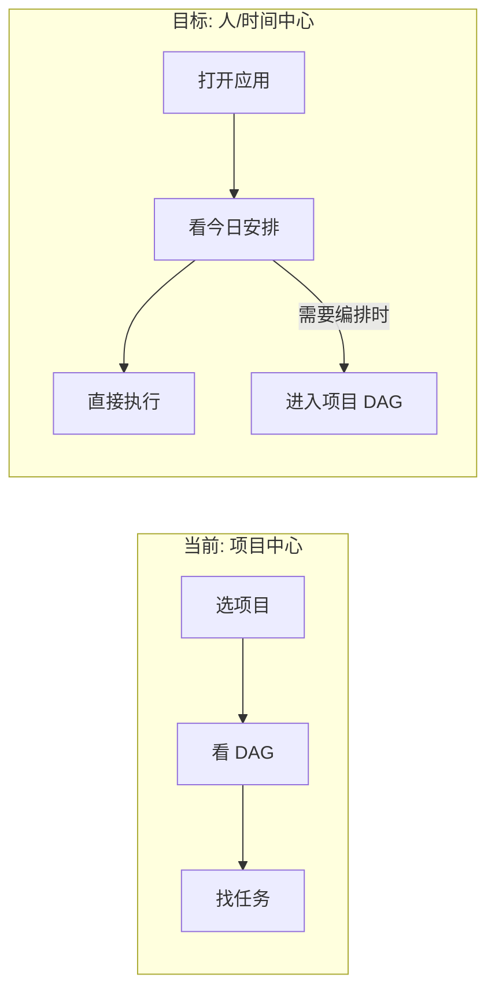

# Human Composer 交互优化与目标对齐方案

## 目标对齐：重新定义产品核心

当前产品的交互流程是**项目中心**的：选项目 -> 看 DAG -> 找任务。但真实使用场景是**一个人**在管理自己的时间，核心需求是：

> 打开应用，立刻看到：从现在到今天结束，我应该按什么顺序做什么，做完大约几点。

这要求产品的默认首页不是某个项目的 DAG，而是一个**跨项目的日程时间轴**（Today View）。项目 DAG 降级为深度编排工具。



### 用户工作流评估框架

从产品核心价值出发，用户工作流分为四条主线：

1. **Setup（编排）**: 创建项目/支线/任务/依赖关系
2. **Execute（执行）**: 完成 -> 推荐 -> 开始 核心循环
3. **Capture（捕获）**: 快速记录碎片任务并分配
4. **Monitor（监控）**: 了解整体进度与瓶颈

---

## 一、新增核心功能：Today View（今日安排）

### 1.1 定位

- 应用的**默认首页**，取代当前的项目 DAG 视图作为落地页
- 聚合**所有项目**的 Active + Ready 任务，按推荐引擎排序
- 叠加**时间维度**：每个任务有预估时长，按累加映射到时间轴
- 用户打开应用即可回答"现在该做什么、今天还能做多少"

### 1.2 视觉布局

```
今日安排                           剩余 3h20min / 可用 6h40min
━━━━━━━━━━━━━━━━━━━━━━━━━━━━━━━━━━━━━━━━━━━━━━━━━━━━━━━━━━
 13:30  ★ Dashboard 页面               HC开发 · 前端
 NOW      预估 45min                   [完成] [暂停]
────────────────────────────────────────────────────────────
 14:15    CI 配置                      HC开发 · 部署
          预估 30min
────────────────────────────────────────────────────────────
 14:45    博客首页重构                  博客项目 · 前端
          预估 1h
────────────────────────────────────────────────────────────
 15:45    图表组件                     HC开发 · 前端
          预估 40min
━━━━━━━━━━━━━━━━━━━━━━━━━━━━━━━━━━━━━━━━━━━━━━━━━━━━━━━━━━
 今日已完成 5 项 · 剩余 4 项 · 预计 16:25 完成
```

- **顶部**：日期 + 时间预算摘要（剩余工作量 vs 可用时间）
- **当前任务**：大卡片，醒目的完成/暂停按钮
- **队列**：按推荐顺序排列的 Ready 任务，每张卡片显示任务名、项目/支线标签、预估时长、预计时间段
- **底部**：今日 summary（已完成数 / 剩余数 / 预计完成时间）
- **已完成区**：折叠显示，可展开查看

### 1.3 交互规则

- **完成当前任务** -> 队列自动上移，时间段重算，下一个任务成为 Active（无弹窗）
- **拖拽调整顺序** -> 覆盖推荐排序，时间段随之重算
- **点击任务的项目标签** -> 切换到该项目的 DAG 视图
- **跳过任务** -> 任务移到队列末尾或从今日安排中移除
- **添加休息** -> 在队列中插入缓冲时间段

### 1.4 数据模型变更

Task 新增字段：

```
estimated_minutes: Option<i32>  -- 预估时长（分钟），用户可选填，默认 30
```

App Settings 新增：

```
day_end_time: "22:00"  -- 一天结束时间，用于计算可用时间
```

### 1.5 Today Snapshot（新后端 API）

后端新增 `get_today_snapshot` command，返回：
- 跨所有项目的 Active 任务（全局最多 1 个）
- 跨所有项目的 Ready 任务，经推荐引擎排序
- 每个任务附带项目名 + 支线名 + 预估时长
- 今日已完成任务列表（按完成时间排序）
- 时间预算计算结果（剩余工作量 / 可用时间 / 预计完成时间）

### 1.6 UI 组件树

```
TodayView (主窗口默认视图)
+-- TodayHeader
|   +-- 日期显示
|   +-- TimeBudgetBar (剩余工作量 / 可用时间 进度条)
+-- ActiveTaskCard (当前任务大卡片)
|   +-- TaskTitle + ProjectBranchTag
|   +-- EstimatedDuration
|   +-- CompleteButton + PauseButton
+-- ScheduleList (可拖拽排序)
|   +-- ScheduleItem (多个)
|       +-- TimeSlot (预计开始时间)
|       +-- TaskTitle + ProjectBranchTag
|       +-- EstimatedDuration
|       +-- SkipButton
+-- DaySummary
|   +-- 已完成数 / 剩余数 / 预计完成时间
+-- CompletedSection (折叠)
    +-- 今日已完成任务列表
```

### 1.7 Sidebar 变更

```
Sidebar
+-- TodayButton ("今日", 默认选中, 回到 TodayView)
+-- Separator
+-- ProjectList (点击进入项目 DAG, 各项目附简化进度)
+-- AddProjectButton
```

### 1.8 三层交互面同步更新

- **L1 菜单栏**：数据源改为 today snapshot（当前已是跨项目的，结构基本不变）
- **L2 悬浮窗**：数据源从"当前项目 snapshot"改为"today snapshot"，展示今日队列前几项；完成后自动推荐下一个
- **L3 主窗口**：默认首页为 TodayView；Sidebar 点击项目时切换到该项目的 DAG 视图；点击"今日"回到 TodayView

---

## 二、现有交互问题修复

### [P0] 核心工作流断裂

**2.1 支线（Branch）管理在主界面完全缺失**

现状：后端有 `create_branch`、`archive_branch` API（[`api/tauri.ts`](src/api/tauri.ts)），但主窗口没有任何创建支线的入口。用户无法定义自己的并行执行轨道，Setup 工作流断裂。

修复：
- DAG 画布泳道标签区底部添加"+ 新支线"按钮
- 泳道标签（[`LaneLabelNode.tsx`](src/components/dag/LaneLabelNode.tsx)）双击可重命名
- 右键泳道标签弹出上下文菜单：重命名 / 归档
- 后端新增 `rename_branch` + `unarchive_branch` command
- 被归档支线可在设置或项目详情中查看和恢复

**2.2 推荐弹窗违反"无确认弹窗"设计原则**

现状：[`RecommendPrompt.tsx`](src/components/recommend/RecommendPrompt.tsx) 是 `position: fixed` 居中模态弹窗，每次完成任务都阻断用户。

```css
/* 当前 -- 阻断式 */
.recommend-prompt { position: fixed; top: 50%; left: 50%; z-index: 900; }
```

修复：
- DAG 视图中改为右下角 Toast-like 滑入卡片，5-8 秒后自动消失，不阻断操作
- 卡片内一键"开始推荐的任务"+ "查看更多 Ready"
- Today View 中无需弹窗：队列自动上移即为推荐
- 点击外部或不操作均自动淡出

**2.3 任务和项目删除功能缺失**

现状：只有 `delete_task` 后端 API，前端无任何删除入口。无项目删除功能。

修复：
- [`DetailPanel.tsx`](src/components/detail/DetailPanel.tsx) 底部添加"删除任务"按钮（红色，配 Undo toast）
- 任务节点右键菜单添加删除选项
- Sidebar 项目 item 右键弹出删除选项
- 后端新增 `delete_project` command

### [P1] 核心循环缺陷

**2.4 悬浮窗单击/双击导致 220ms 交互延迟**

现状：[`FloatingWidget.tsx`](src/components/floating/FloatingWidget.tsx) 用 `setTimeout(220ms)` 区分展开和打开主窗口。

```typescript
// 当前 -- 220ms 延迟
const handleExpandClick = () => {
  expandClickTimer.current = setTimeout(() => { void resize(true); }, 220);
};
```

修复：取消双击手势，折叠态单击即时展开（0ms），展开态 header 用明确的按钮打开主窗口。

**2.5 Detail Panel 缺少关键操作按钮**

现状：[`DetailPanel.tsx`](src/components/detail/DetailPanel.tsx) 显示任务状态但无状态流转按钮，显示依赖但无删除按钮，无删除任务入口。

修复：
- 状态区域添加操作按钮组：开始 / 完成 / 暂停（根据当前状态动态显示）
- 依赖列表每项添加"x"删除按钮（调用 `remove_dependency` API）
- 添加"添加依赖"入口（下拉选择任务）
- 底部添加删除任务（配 Undo toast）
- 添加"移动到其他支线"操作
- 添加"预估时长"编辑（新增字段）

**2.6 悬浮窗完成-推荐循环断裂**

现状：[`FloatingWidget.tsx`](src/components/floating/FloatingWidget.tsx) 完成任务后只调 API，不展示推荐。

```typescript
// 当前 -- 完成后无推荐
const complete = async () => {
  await api.completeTask(active.task.id, snapshot.projectId);
  // 缺失：没有获取和展示推荐
};
```

修复：
- 完成后使用 `CompleteTaskResult.recommendations` 更新 UI
- 折叠态完成后自动展开显示推荐
- 数据源改为 today snapshot 后，队列自动前进即为推荐

**2.7 Active 任务约束未向用户传达**

现状：[`db.rs`](src-tauri/src/db.rs) `activate_task` 静默将其他 active 设为 ready，UI 无提示。

```rust
// 静默切换
pub fn activate_task(&self, task_id: &str, project_id: &str) -> rusqlite::Result<Task> {
    self.conn.execute("UPDATE tasks SET status = 'ready' WHERE status = 'active' AND project_id = ?1", ...);
    self.set_task_status(task_id, TaskStatus::Active)
}
```

修复：激活新任务时 Toast 提示"已切换到「新任务」，「旧任务」已暂停"。Today View 的单 Active 模型天然传达了这一约束。

**2.8 Inbox 分配交互粗糙**

现状：[`InboxPanel.tsx`](src/components/inbox/InboxPanel.tsx) 每个 item 旁排列所有支线按钮，`draggable` 属性无 handler。

修复：
- 点击 inbox item 弹出轻量下拉选择支线（自动建议项高亮在顶部）
- 或实现 DnD 从 Inbox 拖到泳道（后期增强）

**2.9 依赖关系无法从 UI 删除**

现状：可在 DAG 连线创建依赖，但无删除 UI。`remove_dependency` API 存在但无前端调用。

修复：Detail Panel 依赖列表每项添加"x"删除按钮。

**2.10 支线内任务排序不可调整**

现状：`sort_order` 决定泳道内顺序，但无 UI 调整。

修复：Detail Panel 添加"上移/下移"按钮，或 DAG 内拖拽调整（更新 `sort_order` 并重新布局）。

**2.11 完成任务视觉降噪**

现状：Done 任务以 65% 透明度占据泳道空间。

修复：ProjectHeader 添加"隐藏已完成"开关，默认折叠 Done 任务为计数标记"3 done"。

### [P2] 体验提升

**2.12 Command Palette 功能简陋**

现状：[`CommandPalette.tsx`](src/components/command/CommandPalette.tsx) 只 3 个固定命令，无模糊搜索、无任务导航。

修复：
- 输入即模糊搜索所有任务（跨项目）
- 支持命令前缀：`/add`、`/switch`、`/branch`、`/complete`
- 搜索结果列表可键盘上下选择 + Enter 执行
- 搜索结果分组显示（任务 / 项目 / 命令）

**2.13 Toast 缺少退出动画和时间指示**

修复：添加退出动画（fade-out）+ 底部进度条指示剩余时间 + 悬停暂停计时。

**2.14 DAG 画布空状态引导缺失**

修复：新项目空状态显示引导卡片带"创建第一条支线"CTA；有支线无任务时泳道内显示添加引导。

**2.15 菜单栏缺少"快速添加任务"入口**

现状：设计文档定义了 Tray 下拉中有此选项，[`tray.rs`](src-tauri/src/tray.rs) 未实现。

修复：Tray menu 添加"快速添加任务…"选项，点击后聚焦到悬浮窗输入框并展开。

**2.16 进度追踪缺失**

修复：
- ProjectHeader 添加完成进度条（Done / Total）
- 泳道标签旁添加支线进度（如 "3/7"）
- Sidebar 项目列表添加简化进度条
- Today View 的 TimeBudgetBar 本身即为全局进度追踪

### [P3] 打磨

**2.17 面板过渡动画**

修复：Sidebar 折叠/展开 CSS transition、Detail Panel slide-in、Inbox smooth height、悬浮窗展开 fade。

**2.18 键盘导航**

修复：DAG 中 Tab 遍历节点 + Enter 展开详情、Escape 关闭面板、Cmd+Z 全局 Undo、方向键 Command Palette 导航。

**2.19 TaskNode 信息密度不足**

修复：底部微标签行（依赖数 / pin / 描述指示器 / 预估时长）、推荐任务脉冲边框、悬停 tooltip。

---

## 三、实施步骤

```mermaid
flowchart TD
    subgraph S1 ["Step 1: 文档对齐"]
        planMD["更新产品设计 plan.md"]
        agentsMD["更新 AGENTS.md"]
    end
    subgraph S2 ["Step 2: 数据层扩展"]
        schema["Task + estimated_minutes 字段"]
        settings["day_end_time 设置"]
        todayAPI["get_today_snapshot command"]
        crossRec["跨项目推荐引擎"]
    end
    subgraph S3 ["Step 3: Today View 前端"]
        todayUI["TodayView 组件族"]
        sidebarSwitch["Sidebar 今日入口 + 视图切换"]
    end
    subgraph S4 ["Step 4: 悬浮窗 + Tray"]
        floatingToday["悬浮窗改用 today snapshot"]
        floatingFix["展开延迟修复 + 完成后推荐"]
        trayAdd["Tray 快速添加入口"]
    end
    subgraph S5 ["Step 5: 支线管理"]
        branchCreate["+ 新支线按钮"]
        branchRename["双击重命名"]
        branchArchive["右键归档 + 恢复"]
    end
    subgraph S6 ["Step 6: DetailPanel 补齐"]
        statusBtns["状态操作按钮组"]
        depDelete["依赖删除"]
        taskDelete["任务删除"]
        moveBranch["移动支线 + 预估时长编辑"]
    end
    subgraph S7 ["Step 7: 推荐改非模态"]
        recToast["DAG 视图: 滑入式推荐卡片"]
    end
    subgraph S8 ["Step 8: Inbox + 删除"]
        inboxDropdown["Inbox 分配改下拉"]
        deleteProject["项目删除功能"]
    end
    subgraph S9 ["Step 9: DAG 交互打磨"]
        activeHint["Active 约束 Toast"]
        doneFold["Done 折叠降噪"]
        taskSort["任务排序 UI"]
        emptyState["空状态引导"]
        progress["进度追踪"]
    end
    subgraph S10 ["Step 10: 体验打磨"]
        cmdPalette["Command Palette 增强"]
        toastAnim["Toast 动画"]
        panelAnim["面板过渡动画"]
        keyboard["键盘导航"]
        nodeInfo["TaskNode 信息密度"]
    end
    S1 --> S2 --> S3 --> S4
    S4 --> S5 --> S6 --> S7
    S7 --> S8 --> S9 --> S10
```



### Step 1: 文档对齐

更新 [`.cursor/plans/human_composer_产品设计_7db1e838.plan.md`](.cursor/plans/human_composer_产品设计_7db1e838.plan.md)：
- 设计哲学后新增"产品核心视角：以人为中心的日程管理"章节
- 分层交互模型更新：Layer 3 拆为 TodayView（默认）+ ProjectDAGView
- 新增"今日安排视图"章节（布局、交互规则、组件树）
- 核心概念模型更新：Task 新增 `estimated_minutes`
- 推荐逻辑更新：融入时间维度的日程排布算法
- UI 组件层级更新：TodayView 组件树 + Sidebar 变更

更新 [`AGENTS.md`](AGENTS.md)：
- 核心功能新增"今日安排视图"

### Step 2: 数据层扩展

后端（Rust）：
- [`models.rs`](src-tauri/src/models.rs)：Task struct 新增 `estimated_minutes: Option<i32>`
- [`db.rs`](src-tauri/src/db.rs)：migration 添加 `estimated_minutes` 列（默认 30）+ `day_end_time` setting
- [`recommend.rs`](src-tauri/src/recommend.rs)：`compute_recommendations` 改为跨项目聚合（接收所有项目的数据）
- [`commands.rs`](src-tauri/src/commands.rs)：新增 `get_today_snapshot` command + `TodaySnapshot` struct
- [`models.rs`](src-tauri/src/models.rs)：新增 `TodaySnapshot`、`TodayScheduleItem` 类型

前端：
- [`types/index.ts`](src/types/index.ts)：新增 `TodaySnapshot`、`TodayScheduleItem` 类型；Task 新增 `estimatedMinutes`
- [`api/tauri.ts`](src/api/tauri.ts)：新增 `getTodaySnapshot`、`updateTaskEstimate` wrapper

### Step 3: Today View 前端

- 新增 `src/components/today/TodayView.tsx` + `.css`（主组件）
- 新增 `src/components/today/TodayHeader.tsx`（日期 + TimeBudgetBar）
- 新增 `src/components/today/ActiveTaskCard.tsx`（当前任务大卡片）
- 新增 `src/components/today/ScheduleList.tsx`（可拖拽排序队列）
- 新增 `src/components/today/ScheduleItem.tsx`（单个任务卡片）
- 新增 `src/components/today/DaySummary.tsx`（底部统计）
- [`store/appStore.ts`](src/store/appStore.ts)：新增 `todaySnapshot` state + `currentView: 'today' | 'project'` + `refreshToday`
- [`Sidebar.tsx`](src/components/layout/Sidebar.tsx)：顶部添加"今日"按钮 + 视图切换
- [`AppShell.tsx`](src/components/layout/AppShell.tsx)：根据 `currentView` 渲染 TodayView 或 ProjectDAGView
- [`useGraphSync.ts`](src/hooks/useGraphSync.ts)：监听 `graph-updated` 时同步刷新 today snapshot

### Step 4: 悬浮窗 + Tray 对齐

- [`FloatingWidget.tsx`](src/components/floating/FloatingWidget.tsx)：数据源改为 `getTodaySnapshot`；完成后获取推荐并展示；折叠态单击即时展开（移除 220ms setTimeout）
- [`tray.rs`](src-tauri/src/tray.rs)：`refresh_tray_menu` 改用 today snapshot；添加"快速添加任务…"菜单项

### Step 5: 支线管理 UI

- [`DAGCanvas.tsx`](src/components/dag/DAGCanvas.tsx)：泳道标签区底部添加"+ 新支线"按钮
- [`LaneLabelNode.tsx`](src/components/dag/LaneLabelNode.tsx)：双击进入编辑模式，blur 保存
- 右键泳道标签弹出上下文菜单：重命名 / 归档
- [`commands.rs`](src-tauri/src/commands.rs)：新增 `rename_branch`、`unarchive_branch` command
- [`api/tauri.ts`](src/api/tauri.ts)：新增对应 wrapper

### Step 6: DetailPanel 补齐

- [`DetailPanel.tsx`](src/components/detail/DetailPanel.tsx)：
  - 状态区域改为操作按钮组（开始/完成/暂停，按状态动态显示）
  - 依赖列表每项添加 `x` 删除按钮（调用 `removeDependency`）
  - 新增"添加依赖"下拉选择
  - 新增预估时长输入（`estimated_minutes`）
  - 新增"移动到其他支线"下拉
  - 底部添加"删除任务"按钮（红色，配 Undo toast）

### Step 7: 推荐改非模态

- [`RecommendPrompt.tsx`](src/components/recommend/RecommendPrompt.tsx)：从居中模态改为右下角滑入卡片，5-8s 自动消失，点击外部消失
- [`RecommendPrompt.css`](src/components/recommend/RecommendPrompt.css)：position 改为 `fixed; bottom; right`，添加 slide-in/fade-out 动画
- Today View 中无需此组件：队列自动推进即为推荐

### Step 8: Inbox 优化 + 删除功能

- [`InboxPanel.tsx`](src/components/inbox/InboxPanel.tsx)：每个 item 的分配交互改为点击弹出下拉选择支线（自动建议高亮），移除 inline 按钮列
- [`commands.rs`](src-tauri/src/commands.rs)：新增 `delete_project` command
- [`db.rs`](src-tauri/src/db.rs)：实现 `delete_project`（级联删除 branches + tasks）
- [`Sidebar.tsx`](src/components/layout/Sidebar.tsx)：项目 item 右键菜单添加删除

### Step 9: DAG 交互打磨

- Active 约束透明化：`activateTask` 后 Toast 提示切换信息
- Done 折叠降噪：[`ProjectHeader.tsx`](src/components/layout/ProjectHeader.tsx) 添加"隐藏已完成"开关；[`swimLaneLayout.ts`](src/layout/swimLaneLayout.ts) 支持过滤 done 任务
- 任务排序：Detail Panel 上移/下移按钮 + 后端 `reorder_task` command
- 空状态引导：[`DAGCanvas.tsx`](src/components/dag/DAGCanvas.tsx) 空状态改为引导卡片（创建支线 CTA）
- 进度追踪：ProjectHeader 进度条 + 泳道标签进度指示 + Sidebar 项目进度条

### Step 10: 体验打磨

- **Command Palette 增强**（[`CommandPalette.tsx`](src/components/command/CommandPalette.tsx)）：跨项目模糊搜索 + 命令前缀 + 键盘上下选择 + 分组显示
- **Toast 动画**（[`ToastContainer.tsx`](src/components/toast/ToastContainer.tsx) / [`.css`](src/components/toast/ToastContainer.css)）：退出动画 + 进度条 + 悬停暂停
- **面板过渡动画**：Sidebar width transition、Detail Panel slide-in、Inbox height transition、悬浮窗 resize fade
- **键盘导航**：Tab 遍历节点 + Enter 详情 + Escape 关闭面板 + Cmd+Z 全局 Undo
- **TaskNode 信息密度**（[`TaskNode.tsx`](src/components/dag/TaskNode.tsx)）：底部微标签行（依赖数 / pin / 预估时长）+ 推荐脉冲边框
