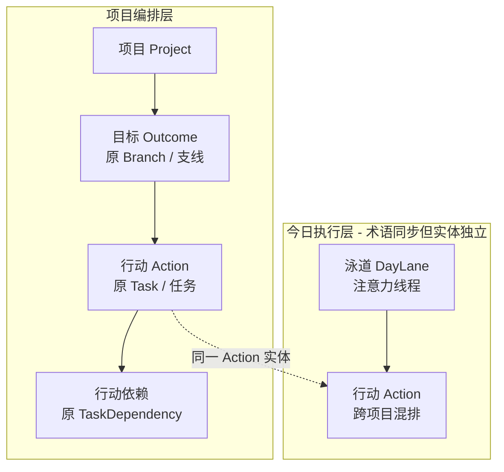
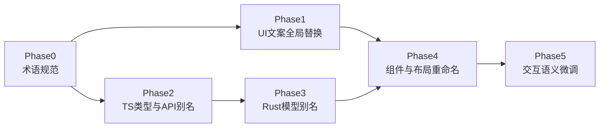

# 支线/任务 → 目标/行动：概念调整与重命名方案

## 决策（已定稿）

| 维度 | 选定方案 | 具体映射 |
|------|----------|----------|
| **中文 UI** | **A. 目标-行动** | 原「支线」→ **目标**；原「任务」→ **行动**（全局统一，含今日安排/悬浮窗/托盘/Inbox） |
| **英文代码** | **α. Outcome + Action** | `Branch` → `Outcome`；`Task` → `Action`（code_alias：DB/IPC/JSON 字段名保持 branch/task 兼容） |
| **实施深度** | code_alias | 类型与函数渐进改名；不迁移 SQLite 表/列 |

**文案约定（方案 A）**：
- 空状态：`创建第一个目标来组织行动`
- Placeholder：`可衡量的目标，如「登录页可上线」`
- Inbox：`随时 capture 碎片行动` / `分配到目标`
- 命令面板 group：`目标` / `行动`；别名 `/outcome`、`/action`（`/branch` 短期保留）

**代码约定（方案 α）**：
- 新代码统一使用 `Outcome` / `Action` 类型与 `createOutcome` / `archiveAction` 等函数名
- 过渡期保留 `type Branch = Outcome`、`type Task = Action` 别名
- 持久化层 indefinitely 保持 `branches`、`tasks`、`branchId`、`taskId`

---

## 一、概念对齐（新心智模型）




| 层级  | 旧概念        | 新概念           | 语义                       |
| --- | ---------- | ------------- | ------------------------ |
| L1  | 项目         | **项目**（不变）    | 顶层容器；可类比 OKR 的 O，但本期不改名  |
| L2  | 支线 Branch  | **目标 Outcome** | 项目内可并行推进的、可衡量的交付成果（类 KR）；UI 称「目标」 |
| L3  | 任务 Task    | **行动 Action**  | 为达成目标而执行的具体步骤（几分钟～半小时） |
| 独立  | 泳道 DayLane | **泳道**（不变）     | 今日注意力线程，≠ 目标 |


**必须写进文档的边界**（避免回归旧 plan 的「支线/泳道混用」）：

- 目标（Outcome）回答：「这个项目要并行推进哪些成果？」
- 泳道回答：「我今天用哪几条注意力线程执行？」
- Inbox = 尚未归属任何目标的行动
- 跨目标依赖 = 原跨支线依赖（BlockingEdge 语义不变）

---

## 二、命名映射参考（已选 A + α，其余方案存档）

### 2.1 中文 UI — 已采用方案 A

| 原词 | 新词 | 备注 |
|------|------|------|
| 支线 | **目标** | 文档/注释中可写「目标（Outcome，类 KR 交付成果）」消歧 |
| 任务 | **行动** | 全局统一，含泳道/托盘/Inbox |

未选方案存档：B 交付目标-行动 / C 关键结果-行动 / D 成果-行动。

### 2.2 英文代码 — 已采用方案 α

| 原标识 | 新标识 |
|--------|--------|
| `Branch` | `Outcome` |
| `Task` | `Action` |
| `TaskWithBranch` | `ActionWithOutcome` |
| `BranchSuggestion` | `OutcomeSuggestion` |
| `branchName` / `branchId`（代码层） | `outcomeName` / `outcomeId`（JSON/DB 仍发旧名） |

未选方案存档：β KeyResult+Action / γ DeliveryTarget+Action。

### 2.3 code_alias 契约

- **DB 不变**：表 `branches`、`tasks`，列 `branch_id` 等保持
- **IPC 命令不变**：`invoke("create_branch")` 等保持；TS 包装函数改名为 `createOutcome`
- **JSON 字段不变**：`branches[]`、`tasks[]`、`branchId`、`taskId` 保持；Rust/TS 新字段名用类型别名映射
- **serde 示例**（Rust `[models.rs](src-tauri/src/models.rs)`）：

```rust
pub struct ProjectGraph {
    #[serde(alias = "branches")]
    pub outcomes: Vec<Outcome>,
    #[serde(alias = "tasks")]
    pub actions: Vec<Action>,
    // ...
}
```

- **TS 示例**（`[types/index.ts](src/types/index.ts)`）：`export type Branch = Outcome` 过渡期保留；新代码只用 `Outcome`/`Action`

---

## 三、影响面分析

### 3.1 仅文案（~25 处 UI + Toast + 托盘）

核心文件：

- 项目编排：`[KanbanBoard.tsx](src/components/project/KanbanBoard.tsx)`、`[BranchColumnHeader.tsx](src/components/project/BranchColumnHeader.tsx)`、`[ProjectWorkspace.tsx](src/components/project/ProjectWorkspace.tsx)`、`[ProjectFooterBar.tsx](src/components/project/ProjectFooterBar.tsx)`、`[DAGCanvas.tsx](src/components/dag/DAGCanvas.tsx)`、`[TaskNode.tsx](src/components/dag/TaskNode.tsx)`、`[AddTaskInline.tsx](src/components/project/AddTaskInline.tsx)`
- 详情/Inbox/命令：`[DetailPanel.tsx](src/components/detail/DetailPanel.tsx)`、`[InboxPanel.tsx](src/components/inbox/InboxPanel.tsx)`、`[CommandPalette.tsx](src/components/command/CommandPalette.tsx)`
- 今日/悬浮/托盘：`[DayRunway.tsx](src/components/runway/DayRunway.tsx)`、`[LaneTrack.tsx](src/components/runway/LaneTrack.tsx)`、`[TaskBlock.tsx](src/components/runway/TaskBlock.tsx)`、`[ExternalTaskDialog.tsx](src/components/runway/ExternalTaskDialog.tsx)`、`[FloatingWidget.tsx](src/components/floating/FloatingWidget.tsx)`、`[tray.rs](src-tauri/src/tray.rs)`
- Store Toast：`[appStore.ts](src/store/appStore.ts)`

### 3.2 代码别名层（类型/函数/组件名，JSON 不变）


| 区域      | 当前                                                      | 目标                                                     | 文件                                                                                                   |
| ------- | ------------------------------------------------------- | ------------------------------------------------------ | ---------------------------------------------------------------------------------------------------- |
| Rust 模型 | `Branch`, `Task`                                        | `Outcome`, `Action` + type alias                       | `[models.rs](src-tauri/src/models.rs)`                                                               |
| 复合类型    | `TaskWithBranch`, `BranchSuggestion`                    | `ActionWithOutcome`, `OutcomeSuggestion` + serde alias | models + `[types/index.ts](src/types/index.ts)`                                                      |
| 字段      | `branch_name`, `branchName`                             | `outcome_name`, `outcomeName` + `#[serde(alias)]`      | models, runway/recommend 输出                                                                          |
| TS API  | `createBranch`, `archiveTask`…                          | `createOutcome`, `archiveAction`…（invoke 字符串不变）        | `[tauri.ts](src/api/tauri.ts)`                                                                       |
| Store   | `createBranch`, `addBranchTask`…                        | `createOutcome`, `addOutcomeAction`…                   | `[appStore.ts](src/store/appStore.ts)`                                                               |
| 布局数据    | `branchName` in node data                               | `outcomeName`                                          | `[kanbanLayout.ts](src/layout/kanbanLayout.ts)`, `[swimLaneLayout.ts](src/layout/swimLaneLayout.ts)` |
| 内部模块    | `suggest_branch`, `compute_recommendations(branches,…)` | 函数参数改名，逻辑不变                                            | `[auto_assign.rs](src-tauri/src/auto_assign.rs)`, `[recommend.rs](src-tauri/src/recommend.rs)`       |


### 3.3 组件/文件重命名（可放最后一阶段，非阻塞）

- `BranchColumnHeader` → `OutcomeColumnHeader`（`[BranchColumnHeader.tsx](src/components/project/BranchColumnHeader.tsx)`）
- `TaskNode` → `ActionNode`（`[TaskNode.tsx](src/components/dag/TaskNode.tsx)`）
- React Flow `nodeTypes` 键：`branchHeader` → `outcomeHeader`，`task` → `action`（仅前端本地）
- CSS 类名前缀可渐进改，非必须

### 3.4 明确不改

- SQLite 表/列名、`TaskStatus` 枚举值（`inbox`/`ready`/…）
- Tauri `invoke` 命令字符串（`create_branch`, `complete_task`…）
- **泳道** `DayLane` / `day_lanes` 全套命名
- Git 分支策略里的 branch（无关）

### 3.5 交互语义微调（超越换词）

与「目标（Outcome）」概念配套的轻量 UX 调整（建议同期做）：

1. **创建引导**：目标 placeholder 强调可衡量成果，而非「前端/后端」式职能名
2. **进度展示**：列头 `done/total` 可改为 `已完成行动 / 总行动` 或保留数字（文案在 aria-label 体现）
3. **详情面板**：`支线: xxx` → `目标: xxx`；`跨支线依赖` → `跨目标依赖`
4. **悬浮窗分组**：`选择支线` → `选择目标`（仍指项目内 Outcome，不是泳道）
5. **推荐 Toast**：`建议分配到「xxx」` 保留逻辑，xxx 为 Outcome 名
6. **顺带清理**：`[DetailPanel.tsx](src/components/detail/DetailPanel.tsx)` 中 `window.prompt` 重命名（与归档/删除同类 Tauri 问题），改为 inline 编辑

---

## 四、分阶段执行方案




### Phase 0 — 术语规范（先定稿再改代码）

- 更新 `[AGENTS.md](AGENTS.md)` 核心功能描述与层级关系
- 更新 `[.cursor/plans/human_composer_产品设计_7db1e838.plan.md](.cursor/plans/human_composer_产品设计_7db1e838.plan.md)` 中「核心概念模型」章节，修正 Branch=泳道 旧表述
- 在 AGENTS.md 增加 **Glossary** 表：Project / Outcome / Action / DayLane / Inbox

### Phase 1 — UI 文案全局替换（方案 A：目标-行动）

- 批量替换 25+ 处中文；统一 Toast、托盘、aria-label、placeholder
- 命令面板：新增 `/outcome`、`/action` 前缀；`/branch` 保留 1 个版本作 hidden alias
- **验收**：项目 Kanban、今日安排、悬浮窗、Inbox、命令面板、托盘菜单均无「支线」「任务」旧词（泳道相关「任务」改为「行动」）

### Phase 2 — TypeScript 类型与 API 别名

- `[types/index.ts](src/types/index.ts)`：`Outcome`/`Action` 为主类型；`Branch`/`Task` 为 `export type` 别名
- `ProjectGraph.outcomes` / `.actions` 读写时兼容 `branches`/`tasks` JSON（deserialize 双支持）
- `[tauri.ts](src/api/tauri.ts)` + `[appStore.ts](src/store/appStore.ts)`：公开 API 改用 `createOutcome`、`archiveAction` 等；内部 `invoke` 不变
- `[useGraphSync.ts](src/hooks/useGraphSync.ts)` 等消费者逐步改用新字段名

### Phase 3 — Rust 模型与快照字段别名

- `[models.rs](src-tauri/src/models.rs)`：`Outcome`/`Action` 结构体；`ProjectGraph` 字段 serde alias
- `TaskWithBranch` → `ActionWithOutcome`（JSON 仍发 `branchName` 直至前端完全切换，或双字段短期并存）
- `[commands.rs](src-tauri/src/commands.rs)`、`[db.rs](src-tauri/src/db.rs)`、`[recommend.rs](src-tauri/src/recommend.rs)`、`[runway.rs](src-tauri/src/runway.rs)`、`[auto_assign.rs](src-tauri/src/auto_assign.rs)`：参数/变量改名，SQL 不动
- `cargo test` / `npm run build` 通过

### Phase 4 — 组件与布局重命名（可选同 PR 或跟进）

- 文件重命名 + import 路径更新
- React Flow `nodeTypes` / layout 文件中的 `branchId` → 代码中用 `outcomeId`（JSON/DB 仍 `branchId`）

### Phase 5 — 交互语义微调

- Placeholder/空状态文案强化 KR 式命名
- DetailPanel 重命名改为 inline（去掉 `window.prompt`）
- 视需要：ProjectHeader 统计文案 `N 个目标 · M 项行动`

### 提交节奏（按 AGENTS 规范拆分）

1. `docs: add Outcome/Action glossary and update product concepts`
2. `refactor(ui): rename branch/task labels to outcome/action (Chinese)`
3. `refactor(ts): introduce Outcome/Action types with JSON aliases`
4. `refactor(rust): rename Branch/Task models with serde aliases`
5. `refactor(ui): rename Branch/Task components to Outcome/Action`

---

## 五、风险与回滚


| 风险                          | 缓解                                     |
| --------------------------- | -------------------------------------- |
| 前后端 JSON 字段不一致              | serde/TS 双 alias；Phase 2/3 完成前不删旧字段    |
| `branchId` 与 `outcomeId` 混用 | 代码审查 checklist；ESLint 可加 deprecated 注释 |
| 用户本地 DB 无影响                 | 表名不变，零迁移                               |
| 术语「目标」与项目目标混淆               | Glossary + placeholder 示例约束            |


回滚：文案 commit 可独立 revert；类型别名可保留旧 `type Branch = Outcome` 长期兼容。

---

## 六、下一步

决策已定（**A + α**），可按 Phase 0 → Phase 5 顺序开工。确认后回复「执行计划」即可开始实施。