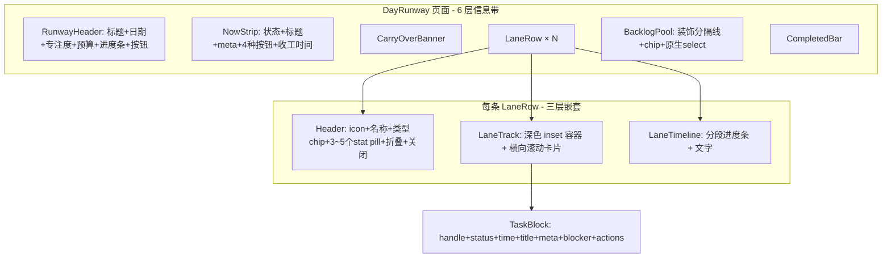

# 泳道 UI 优化方案（Linear 风格）

## 设计约束（用户确认）

1. **泳道保持横向** — `LaneTrack` 横向滚动卡片队列是核心交互隐喻，不改为纵向列表
2. **任务保持卡片** — 不降级为 compact row；对 `TaskBlock` / `ExternalTaskBlock` 做系统性样式与信息密度优化
3. **悬浮窗纳入范围** — [`FloatingWidget`](src/components/floating/FloatingWidget.tsx) 需与主界面同步 Linear 化

---

## 现状诊断

当前 [`DayRunway`](src/components/runway/DayRunway.tsx) 泳道界面功能完整，但视觉与信息架构存在系统性问题：



### 核心问题（按严重度）

| 问题 | 表现 | 违背的原则 |
|------|------|-----------|
| **信息重复** | NowStrip 与 TaskBlock 同时展示完成/领取/委派；Header 与 LaneRow 都显示收工时间 | 简洁 |
| **嵌套过深** | 页面卡片 → 泳道卡片 → 深色 track 容器 → 任务卡片，四层 box | 简洁、Linear 扁平 |
| **装饰过多** | 渐变背景、彩色顶边、虚线边框、脉冲动画、uppercase pill、Backlog 的 `┄┄` 装饰 | 简洁、科技感 |
| **卡片排版混乱** | 110px 高卡片内 status pill + time badge + meta 行 + blocker box + action bar 五层；不等宽导致视觉参差 | 可理解 |
| **语义模糊** | 卡片宽度 + LaneTimeline + Header 预算，三种时间隐喻并存 | 可理解 |
| **组件割裂** | Backlog 用原生 `<select>`；悬浮窗 emoji + uppercase section 与主界面风格不一致 | Linear 一致性 |

[`theme.css`](src/styles/theme.css) 已有 Linear 风格 token，但 [`DayRunway.css`](src/components/runway/DayRunway.css)（~1400 行）大量硬编码 rgba、渐变、多重 border，未充分贯彻 token 体系。

---

## 设计目标：Linear 风格映射

Linear 的核心视觉语言（**适配横向卡片场景**）：

- **Flat surfaces** — 去掉 lane/track 双层 inset；泳道 section 用 1px 分隔，卡片本身单层 `--bg-elevated`
- **Muted by default** — 排队卡片灰阶；仅 active / claimable 卡片用 accent 左边线或 subtle glow
- **Hover reveals** — 卡片内操作按钮、泳道 rename/close、drag grip 默认隐藏，hover 时出现
- **Compact cards** — 卡片高度从 110px 压缩到 ~80–88px；信息 2 行以内（标题 + meta）
- **Uniform card width** — 放弃大幅不等宽（100–320px）；统一固定宽度（建议 180px），时长仅作文字角标
- **Single accent** — 一个主色表达「进行中」，其余降饱和
- **Typography ladder** — 13px 标题 + 11px 次要，最多 2 级字重对比

---

## 优化方案（分区域）

### 1. 页面级：压缩为 3 带结构

**Before:** Header + NowStrip + Banner + Lanes + Backlog + Completed（6 带）

**After:**

```
┌─────────────────────────────────────────────────────────┐
│ 6月2日 周一          预计 18:30 收工 · 剩余 4h    [+ 泳道] │  ← 单行 toolbar
├─────────────────────────────────────────────────────────┤
│ ● 编写 Dashboard API                          [完成]     │  ← 唯一 hero 行动区
├─────────────────────────────────────────────────────────┤
│ 泳道（横向卡片 track，见下）                               │
│ 待分配 · 3                                              │
└─────────────────────────────────────────────────────────┘
```

**具体改动：**

- [`RunwayHeader.tsx`](src/components/runway/RunwayHeader.tsx)：去掉大标题「今日安排」，改为 **日期左对齐 + 预算右对齐** 的单行 toolbar；`FocusHealthIndicator` 改为 dot + tooltip
- 去掉独立 4px 进度条，over-budget 时 budget 文字变红即可
- [`NowStrip.tsx`](src/components/runway/NowStrip.tsx)：**只保留标题 + 一个主 CTA**，去掉 meta/收工时间/多按钮并列
- [`CarryOverBanner.tsx`](src/components/runway/CarryOverBanner.tsx)：改为 header 内联小 badge，非独立 banner 块

### 2. 泳道行：扁平 section + 保留横向 track

**Before:** 带渐变/顶边的大卡片 `.lane-row`，内含深色 inset `.lane-track`

**After:** Linear 式 **section group** — 无外层 card border；header 一行 + 下方横向卡片 track（无 inset 容器）

```
▎主线                              2/5 · ~1h30        ⌄
  ┌──────────┐  ┌──────────┐  ┌ ─ ─ ─ ─┐
  │● 编写 API │→ │○ 联调    │  │◌ 部署   │
  │  30m      │  │  45m     │  │  等待CI │
  └──────────┘  └──────────┘  └ ─ ─ ─ ─┘
```

**具体改动：**

- [`LaneRow.tsx`](src/components/runway/LaneRow.tsx) + CSS：
  - 去掉 `.lane-row` 的 gradient、box-shadow、border-top 彩色条
  - 用左侧 2px accent 竖线区分 focus/watch（替代 type chip「专注/等待」）
  - Header 精简为：**名称 + 进度分数 + 预计时间**；「待审核」仅 orange dot
  - rename/close/collapse **hover 时才显示**
- [`LaneTrack.tsx`](src/components/runway/LaneTrack.tsx) + CSS：
  - **保留横向 flex + overflow-x scroll**
  - 去掉 `.lane-track` 的深色 inset 背景与内层 border（卡片直接排列在 section 下）
  - 卡片间距统一 8px；依赖箭头保留但改为更细的 muted connector

### 3. 任务卡片：系统性样式优化（非降级为列表）

[`TaskBlock.tsx`](src/components/runway/TaskBlock.tsx) 保留卡片形态，重构内部结构：

| 移除 / 简化 | 保留 / 优化 |
|------------|------------|
| 18px 独立 drag handle 条 | 卡片顶部 hover 显示 grip 或整卡 draggable |
| status uppercase pill | 卡片左上角 6px 状态 dot |
| time badge pill | 右上角 muted `30m` 文字 |
| meta 独立行 | 标题下方单行 `HC · 后端` |
| blocker 独立 dashed box | 标题行 inline `(等待 CI)` |
| 底部 action bar + border-top | hover 时卡片底部浮出 icon buttons；active 卡片仅保留 pause |
| `blockWidth()` 100–320px 不等宽 | **固定宽度 180px**（或 160–200 窄范围），视觉整齐 |

[`ExternalTaskBlock.tsx`](src/components/runway/ExternalTaskBlock.tsx)：

- 同样固定宽度，去掉渐变 card
- 进度改为卡片底部 2px 细线，不用独立 progress bar 区域
- 紫色仅通过 left dot + 细 border 表达

**NowStrip 与 TaskBlock 分工：** NowStrip = 全局 hero + 主 CTA；active 卡片仅高亮（left accent bar），不重复「完成」按钮（保留 pause / 委派 hover）。

### 4. 时间可视化：二选一

当前：卡片不等宽 + LaneTimeline + Header 预算 — 冗余。

**推荐方案：**

- 保留 **Header 级时间预算** + **Lane header 预计完成时间**
- **删除 [`LaneTimeline.tsx`](src/components/runway/LaneTimeline.tsx)**（时间不再通过卡片宽度和 timeline 双重表达）
- **删除 `blockWidth()` 宽度映射**（[`taskBlockUtils.ts`](src/components/runway/taskBlockUtils.ts) 中移除或改为常量 `CARD_WIDTH`）
- 依赖关系：保留 [`DependencyConnector.tsx`](src/components/runway/DependencyConnector.tsx) 横向箭头，样式 muted

### 5. Backlog / Completed：卡片化或 chip 简化

- [`BacklogPool.tsx`](src/components/runway/BacklogPool.tsx)：
  - section label：`待分配 · 3`（去掉 `┄┄` 装饰）
  - chip 样式对齐 TaskBlock 卡片（同宽、同高、可横向 scroll 或 wrap）
  - 原生 `<select>` 替换为 hover popover menu
- [`CompletedBar.tsx`](src/components/runway/CompletedBar.tsx)：默认折叠 `已完成 5 项 ⌄`，展开后用 muted 小卡片或单行

### 6. 色彩与动效：做减法

在 [`DayRunway.css`](src/components/runway/DayRunway.css) 中：

- 删除所有 `linear-gradient` 背景
- 状态色从 border + background + pill 三重降为 **dot + 2px left bar**
- 去掉 `claim-pulse`、`review-glow` 动画
- dashed border 仅用于 pending 卡片外框
- hardcoded rgba 迁移到 [`theme.css`](src/styles/theme.css)：
  - `--surface-card`, `--surface-card-active`, `--surface-card-hover`
  - `--lane-focus-accent`, `--lane-watch-accent`
  - `--card-width: 180px`, `--card-height: 84px`

### 7. 间距与字体 scale

```css
--text-xs: 11px;
--text-sm: 13px;
--text-base: 14px;
--card-width: 180px;
--card-height: 84px;
--card-gap: 8px;
--section-gap: 24px;
--lane-gap: 16px;
```

- 页面 padding：`12px 16px`
- lane 间距：16px

---

## 悬浮窗优化（Phase D）

当前 [`FloatingWidget.tsx`](src/components/floating/FloatingWidget.tsx) 问题：

| 问题 | 现状 |
|------|------|
| 视觉割裂 | emoji 标题（🎯/⏳）、uppercase section header，与主界面 Linear 风格不一致 |
| 信息重复 | expanded 模式每条泳道独立 section + 全宽 CTA，多泳道时纵向冗长 |
| 硬编码色 | `#fb923c` badge 未用 theme token |
| collapsed 态弱 | 仅显示任务名 + 完成，无状态 dot / 泳道名 context |
| 缺 claim 入口 | 无可领取任务的快速「领取」操作 |

### 目标布局

**Collapsed（220×52）：**

```
[●] 编写 Dashboard API · 主线          [✓] [⌄]
     ↑ status dot    ↑ lane name muted
```

**Expanded（320×420）：**

```
6月2日 · 预计 18:30 收工                    [↗] [—]
─────────────────────────────────────────────
▎主线 · 进行中
  编写 Dashboard API                        [完成]
▎Agent · 待审核 ●
  CI 单元测试                               [审核]
▎副线 · 可领取
  联调测试                                  [领取]
─────────────────────────────────────────────
[ 快速添加…                              ]
```

### 具体改动

- [`FloatingWidget.tsx`](src/components/floating/FloatingWidget.tsx)：
  - Header 对齐 RunwayHeader：日期 + 收工时间，去掉「今日安排」大标题
  - 泳道 section 用 left accent bar + 名称 + 状态词（进行中/待审核/可领取），去掉 emoji 和 uppercase
  - 每 section 一行 task + 一个 inline CTA（非全宽按钮）
  - collapsed 态增加 status dot + lane name
  - 增加 claimable 任务的「领取」快捷操作（对齐 NowStrip 优先级）
- [`FloatingWidget.css`](src/components/floating/FloatingWidget.css)：
  - 迁移 hardcoded 色到 theme tokens
  - CTA 改为 inline pill（与主界面 NowStrip 一致）
  - section 间距压缩，去掉多余 border-bottom 叠层
  - 复用 DayRunway 的 `--card-*` / `--lane-*` token（共享 theme.css）

---

## 目标视觉（ASCII wireframe）

```
6月2日 周一                    预计 18:30 收工 · 剩余 4h  [+ 泳道]

┌─ 进行中 ─────────────────────────────────────────────────────────┐
│  编写 Dashboard API                                    [完成] [⏸] │
└──────────────────────────────────────────────────────────────────┘

▎主线                                          2/5 · ~1h30
  ┌─────────────┐   ┌─────────────┐   ┌ ─ ─ ─ ─ ─ ─ ┐
  │● 编写 API    │ → │○ 联调测试    │   │◌ 部署 staging│
  │  30m · HC    │   │  45m · HC    │   │  等待 CI     │
  └─────────────┘   └─────────────┘   └ ─ ─ ─ ─ ─ ─ ┘

▎Agent 等待                                    0/1
  ┌─────────────┐
  │◉ CI 单元测试 │
  │  ~15m ████░░ │
  └─────────────┘

待分配 · 2
  ┌─────────────┐  ┌─────────────┐
  │○ Review PR   │  │◌ 写文档      │
  └─────────────┘  └─────────────┘

已完成 · 3 ⌄
```

对比现有：减少 1 层 box 嵌套（去 inset track）、卡片等高同宽、去掉 timeline 条、header 信息 dedup、悬浮窗对齐。

---

## 实施分期

### Phase A — 视觉减法（低风险，1–2 天）

不改布局结构，CSS + 文案精简：

- Flatten lane-row 样式（去渐变、去 inset track 背景）
- Header / NowStrip / CarryOver dedup
- Backlog 去装饰线；Completed 默认折叠
- Token 迁移 + 间距 scale

**涉及文件：** [`DayRunway.css`](src/components/runway/DayRunway.css), [`RunwayHeader.tsx`](src/components/runway/RunwayHeader.tsx), [`NowStrip.tsx`](src/components/runway/NowStrip.tsx), [`CarryOverBanner.tsx`](src/components/runway/CarryOverBanner.tsx), [`theme.css`](src/styles/theme.css)

### Phase B — 卡片系统优化（中风险，2–3 天）

**保留横向 LaneTrack**，重构卡片：

- TaskBlock / ExternalTaskBlock 内部结构简化（dot + 2 行信息 + hover actions）
- 固定卡片宽度，移除 blockWidth 不等宽逻辑
- 移除 LaneTimeline 组件
- LaneRow 扁平 section 布局
- TaskBlockPreview / DragOverlay 对齐新卡片尺寸

**涉及文件：** [`LaneRow.tsx`](src/components/runway/LaneRow.tsx), [`LaneTrack.tsx`](src/components/runway/LaneTrack.tsx), [`TaskBlock.tsx`](src/components/runway/TaskBlock.tsx), [`ExternalTaskBlock.tsx`](src/components/runway/ExternalTaskBlock.tsx), [`TaskBlockPreview.tsx`](src/components/runway/TaskBlockPreview.tsx), [`taskBlockUtils.ts`](src/components/runway/taskBlockUtils.ts), [`LaneTimeline.tsx`](src/components/runway/LaneTimeline.tsx)（删除）

### Phase C — 交互 polish（1 天）

- 卡片 hover-reveal 操作
- 泳道 header hover-reveal rename/close
- Backlog assign popover 替代 select
- Backlog chip 对齐卡片样式
- 键盘导航（横向 track 内方向键）

**涉及文件：** [`BacklogPool.tsx`](src/components/runway/BacklogPool.tsx), [`CompletedBar.tsx`](src/components/runway/CompletedBar.tsx), [`DependencyConnector.tsx`](src/components/runway/DependencyConnector.tsx)

### Phase D — 悬浮窗 Linear 化（1 天）

- FloatingWidget collapsed/expanded 布局重构
- 对齐主界面 token 与 CTA 风格
- 增加 claim 快捷操作；优化多泳道信息密度

**涉及文件：** [`FloatingWidget.tsx`](src/components/floating/FloatingWidget.tsx), [`FloatingWidget.css`](src/components/floating/FloatingWidget.css)

---

## 不在本次范围

- DAG 项目泳道（[`DAGCanvas.tsx`](src/components/dag/DAGCanvas.tsx)）— 不同心智模型，后续单独 Linear 化
- Tray 菜单栏 — 可 Phase D 之后小改对齐
- 后端数据模型 — 无需改动

---

## 验收标准

1. 首屏信息元素 ≤ 3 个视觉层级（toolbar / hero / lane sections）
2. **泳道内任务保持横向卡片排列**，卡片等高同宽、无 inset 容器嵌套
3. 同一信息（收工时间、完成操作）不在两处同时完整展示
4. 状态色使用 dot + left bar，不用 pill + border + background 三重叠加
5. 悬浮窗 collapsed/expanded 与主界面视觉语言一致（无 emoji section、无 hardcoded 色）
6. 新用户 3 秒内能回答：「我现在该做什么？每条泳道在等什么？」
